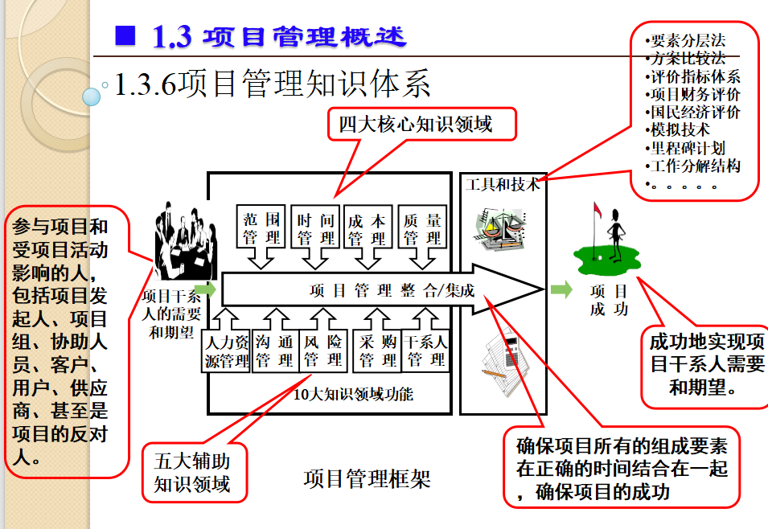
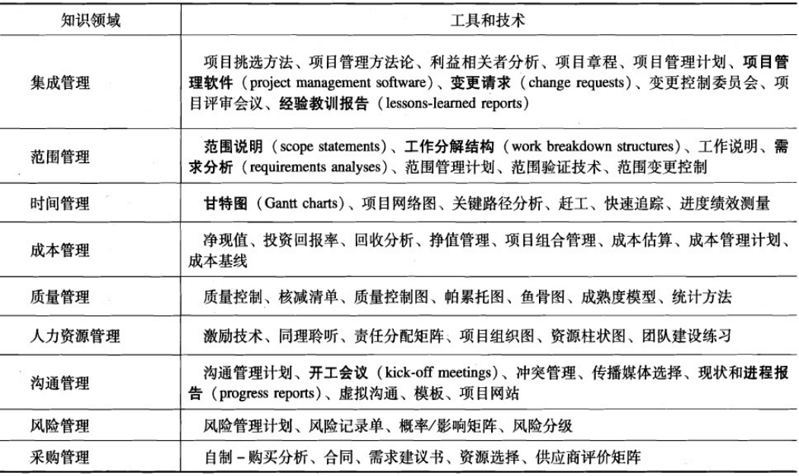
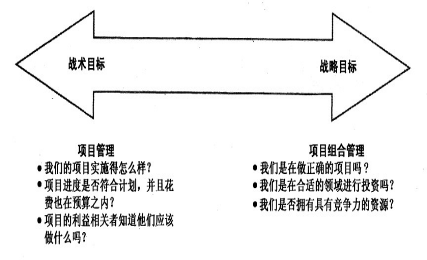
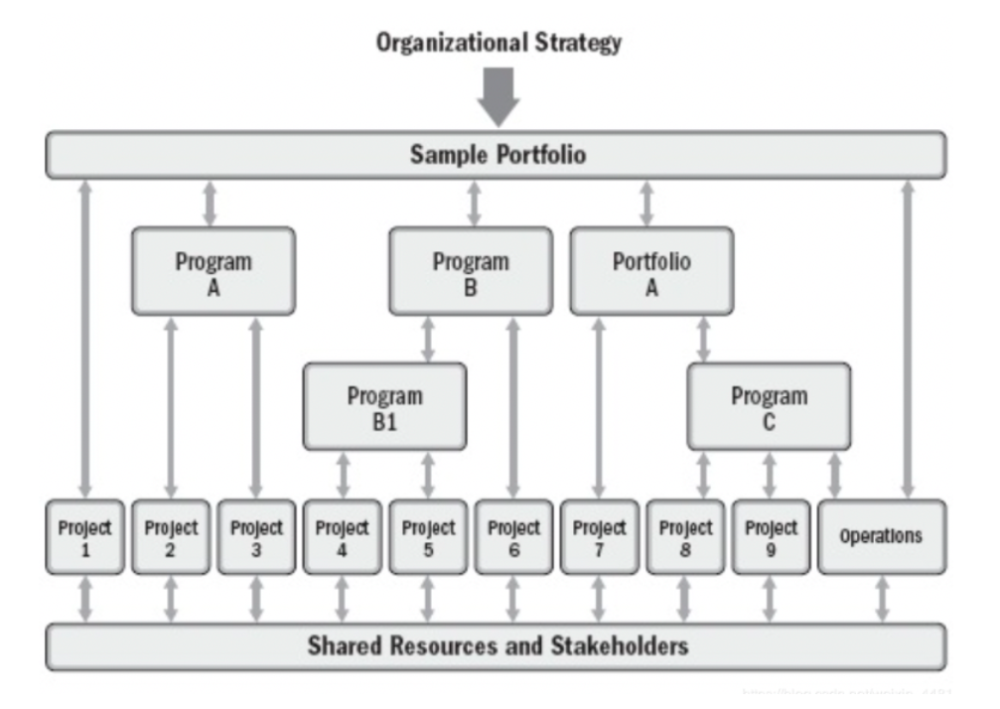
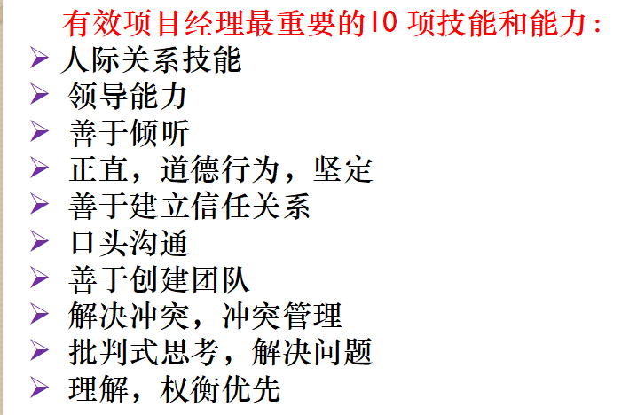
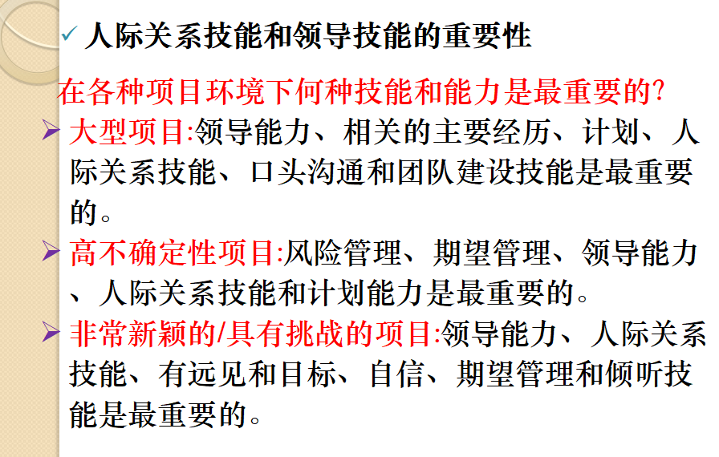
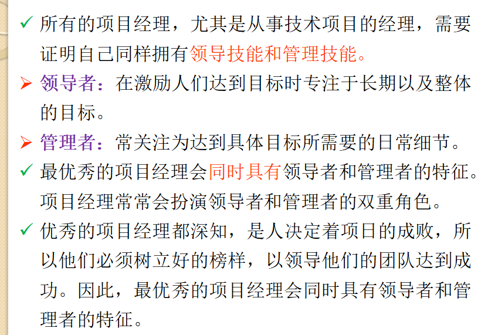

# 第一章：项目管理概述

# 1.1  项目与项目管理的价值

企业三大管理需求：

1. 战略管理：面向未来，是企业发展的核心。
2. 运营管理：面向市场，是企业发展的命脉。
3. 项目管理：面向目标，是企业发展的载体。项目的价值：

# 1.2  项目的基本概念

## 活动

### 基本特点

目的性、依存性、知识性。

1. 目的性：为了达到预期的目的而活动。
2. 依存性：分工越来越细，依存越来越紧密。
3. 知识性：在实践与经验中学习，形成知识体系。

人类活动的这些特点，回答了项目和项目管理实践与人类历史同样悠久的原因。

### 类型

活动的2种类型：作业和项目。

*要会区别某种活动是作业还是项目。例如野餐、婚礼、开发OS系统、神舟飞船计划是项目，社区安保、每日的卫生保洁是作业。*

1. 作业（Operations 运作 运营）

    **连续不断、周而复始的活动**，如企业日常的生产产品的活动、财务人员的日常记账工作等。
2. 项目（Projects）

    **临时性的、一次性的活动**，如企业新产品开发、企业的技术改造活动企业信息系统的开发等。

​​

‍

## 项目定义

IPMA的定义：项目是一个特殊的、**将被完成的有限任务**，它是在**一定时间内，满足一系列特定目标**的多项相关工作的总称。

PMRC定义：项目是**为实现特定目标的一次性任务**。

APM定义：项目是由一系列**具有开始和结束日期、相互协调和控制**的活动组成的，通过实施而达到满足**时间、费用和资源等约束条件**的独特的过程。

PMI定义：项目是为提供某项独特的产品、服务或成果所做的**临时性努力**。

教材定义：**项目就是为创造一件独特的产品、一项服务或者一种结果而进行的临时性努力。**

## 项目组成要素

三维约束：范围（界定）、时间（进度）、成本（费用）。

项目经理在三者之间寻求与保持平衡。

## 项目利益相关者

项目经理、客户、项目执行组织、项目团队成员、项目发起人、出资方。

# 1.3  项目管理概述

## 特点

项目管理的日常活动通常围绕项目计划、项目组织、质量管理、费用控制、进度控制等五项任务来展开。

项目管理与传统的部门管理相比最大的区别是注重于综合性管理，并且强调时间期限。

项目管理必须通过**不完全确定的过程**，在**确定的期限**内生产出**不完全确定的产品或完成不完全确定的任务**。

## 项目管理和作业管理

项目管理：创新性、追求效果，充满了不确定因素，跨越部门的界限，有严格的时间期限要求。

作业管理：惯例性、追求效率，注重对效率和质量的考核、当前执行情况与前期进行比较。

尽管作业管理办法也适用项目，但管理结构须以任务（活动）定义为基础来建立，以便进行时间、费用和人力的预算控制，并对技术、风险进行管理。

## 项目管理知识体系（ Project  Management Body Knowledge, PMBOK）

项目管理划分为10个知识领域和42个管理过程。10个知识领域包括4个核心知识领域、5个辅助知识领域和项目整合管理。

### 过程

定义：为实现某个特定目标而进行的一系列活动。

表示：输入，工具和技术，输出。

​​

​​

# 1.4  IT项目概述

## 定义

利用**有限资源、在一定的时间内**，完成满足一系列特定的IT信息化目标的多项相关工作。

包括使用硬件、软件或者网络来创造**一件产品、一项服务或者一种结果而进行的一次性努力**。

## 特性

除了具有其一般项目所具有的**独特性、一次性、整体性、临时性、不确定性、资源多变性、有一个主要发起人**等特征外，还具有明显的特殊性：目标的不确定性，需求的不稳定性，费用的不可控性，项目的时限性，对智力的依赖性，项目评价的主观性，项目的创新性。

# 1.5  IT项目管理概述

## IT项目管理的定义

PMRC：在一定期限内，根据一定的IT信息化项目需求，依托一定的资源，为达成一定的IT信息化目标而进行的一系列活动。

iPMBOK2004采用三维结构模型，包括面向项目管理职能的职能型iPMBOK、面向项目管理过程的流程型iPMBOK、面向项目管理对象的离散型iPMBOK。

PMI：把各种知识、技能、手段和技术应用于IT项目活动之中，以达到IT项目的要求。IT项目管理是通过应用和综合诸如启动、规划、实施、监控和收尾等IT项目管理过程来进行的。项目经理是负责实现IT项目目标的个人。

# 1.6  软件与软件项目

## 软件的定义

软件（software）是计算机系统中与硬件(hardware)相互依存的另一部分，它是**程序(program)、数据(data)和文档(document)的完整集合**。

## 软件项目

### 定义

利用有限资源、在一定的时间内，完成满足一系列以软件为核心的多项相关工作叫做软件项目。

### 分类

1. 按软件功能(系统软件项目、支撑软件项目、应用软件项目)。
2. 按软件工作方式(实时处理、分时处理、交互式、批处理软件项目)。
3. 按软件开发规模(微型、小型、中型、大型、甚大型、极大型项目)。
4. 按软件服务对象（通用软件项目、定制软件项目）。
5. 按软件的有偿性或无偿性（商用、共享、免费、公用软件项目）。

### 特点

软件项目的最终成果是软件产品，与其他任产品的最大区别是无形和没有物理属性，其特点：高度复杂性；智力密集、可见性差；单件生产、过程不规范；劳动密集、自动化程度低；开发工作渗透了人的因素；开发方法多样性。

# 1.7  软件项目管理

## 定义

软件项目管理是为了使软件项目能够按照预定的范围、成本、进度、质量顺利完成，而对范围、费用、时间、质量、人力资源、风险、采购等进行分析和管理的活动。

软件项目失败的原因：一是软件项目的复杂性，二是缺乏合格的软件项目管理人才。缺乏有效的项目管理是导致软件项目失控的直接原因。

为了完成项目既定目标，需要通过软件项目管理过程来对软件任务进行组织、计划、实施、管理和评估，以明确和满足范围、时间、成本、质量等方面的约束限制。

## 重点

在软件项目管理中还面临许多需要解决的实际问题：

1. 软件项目定义中的问题（定义客户需求、明确项目范围）：首要问题。
2. 软件项目实施中的问题。
3. 软件项目控制中的问题。
4. 软件项目评价中的问题（评价项目、评价项目成员）。

# 1.8  项目群和项目组合管理

## 项目（project）

*强调单一项目，管理重点在项目内部流程。*

## 项目群（program）

项目群（program）：多个相互关联项目的集合，且多个项目间有如下两大基本特征：相互关联，每个项目相互间有一定的相似性。

项目群管理（program Management）：一组相互关联的项目，使用协同方法进行管理来获得收益和进行控制，而这种收益和控制在单独管理这些项目时是不易获得的。

项目群管理强调集成（如IT项目的弱电集成项目），协同与资源优化。

## 项目组合管理（portfolio）

定义：对由项目和项目群有机组合的整体所开展的管理。

项目组合的目的：实现组织战略和愿景，也称战略项目组合。

项目组合管理强调：战略目标（宏观），项目组合的投资回报，资源约束下的项目选择。

组织将项目以及项目群组合进行管理，使其作为一个投资组合，从而促成整个企业的成功。负责项目组合管理的经理从战略视角帮助组织挑选并分析项目，以做出明智的选择。

项目管理和项目组合管理的不同之处：最主要的区别在各自致力于达到的目标上，战术目标还是战略目标。（战术目标更具体,时间短；战略目标重点强调一组织的长期目标）。

[项目 项目集 项目组合管理的理解 ？ - 知乎 (zhihu.com)](https://www.zhihu.com/question/29349187/answer/1094890368)

​​

# 1.9  项目经理的作用

项目经理主要从整体上综合运用各领域的知识以成功地实现项目的运作。是为项目的成功策划和执行负总责的人。

首要职责：**在预算范围内按时优质地领导项目小组完成全部项目工作内容，并使客户满意**。

工作描述：咨询公司项目经理，金融服务公司IT项目经理，非营利性咨询公司IT项目经理。

## 人际关系技能和领导技能的重要性

​​

# 本章小结

> 项目是实现价值、成就事业的载体；项目管理既是项目成功的要素，也是项目失败的根源。
>
> 项目是为完成某一独特的产品或服务而进行的一次性努力；项目的3要素是**范围、时间、费用**。
>
> 项目管理是指在项目活动中运用相关的知识、技能、工具和方法，以实现或超过项目干系人的需要和期望。
>
> 项目管理框架由**干系人、知识领域和管理工具与方法**三部分组成。
>
> 项目群（program）：多个相互关联项目的集合。
>
> 项目群经理对项目组内的项目进行领导并指明方向。协调项目团队，职能部门，供应商和运营员，以支持项目达到产品和过程的最大收益。
>
> 项目组合管理，组织将**项目以及项目群**组合进行管理，使其作为一个投资组合，从而促成整个企业的成功。负责项目组合管理的经理从战略视角帮助组织挑选并分析项目，以做出明智的选择。
>
> 项目管理和项目组合管理的不同之处：最主要的区别在各自致力于达到的目标上，**战术目标还是战略目标**。
>
> IT行业正致力于改进项目管理方法，以改变IT项目成功率较低的现状。
>
> 项目经理主要从整体上综合运用各领域的知识以成功地实现项目的运作。
>
> 项目管理大致经历了潜意识阶段、传统项目管理阶段、项目管理的传播阶段和现代项目管理的发展阶段。
>
> IT产业对项目经理的需求在不断增长，项目管理资格认证在不断发展。

# 快速测验

题目

> 1.（    ）是为创造一种产品、服务或者结构而进行的临时性努力。
>
> 2.项目组合管理强调达到（  ）目标，而项目管理专注于（    ）目标。
>
> 3.（    ）是将知识、技能、工具和技术应用到项目活动，以达到组织的要求。
>
> 4.为相同的功能组合而实施的一系列应用开发项目，作为（      ）的一部分，或许能够得到更好的管理。
>
> 5.项目的三维约束包括（   ）、（   ）、（     ）。

答案

> 1.项目
>
> 2.战略，战术
>
> 3.项目管理
>
> 4.项目群
>
> 5.时间，成本，范围

‍

‍
