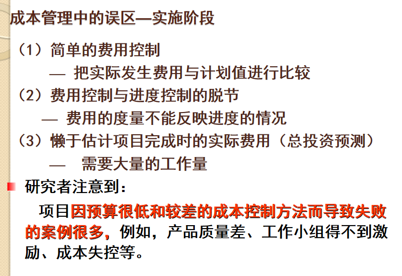
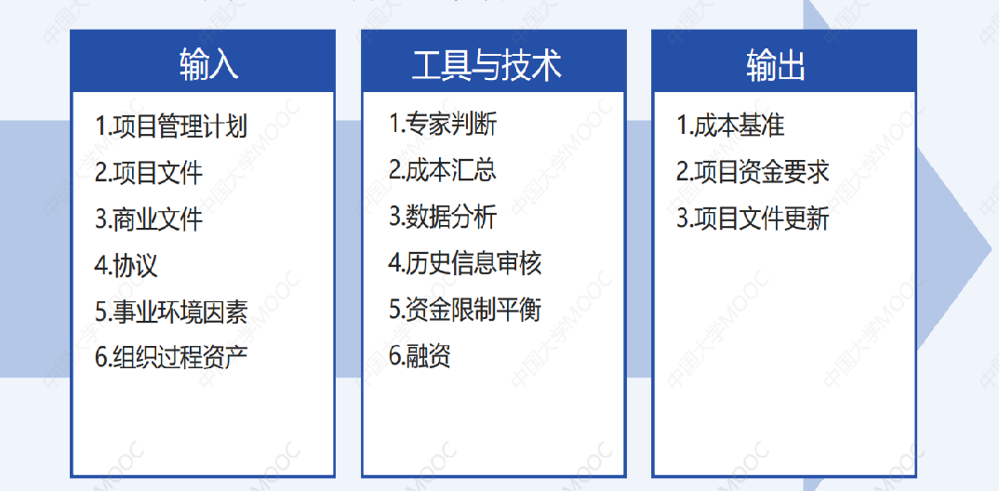

# 第七章：项目成本管理

4个过程组：规划成本管理、成本估算、成本预算和成本控制（前3计划过程，后1监控过程）

# 7.1 项目成本管理的重要性

误区： 

*大题：请结合自身经验结合案例谈谈该项目的成本管理存在的问题*

​​

IT项目成本管理存在的问题：

1. 很多软件项目的原始成本估算不准确。
2. 由于没有经过实际验证，认为成本增长和失败将是预料中的事。
3. 项目经理与项目组对项目成本估算和控制不相关。
4. 项目组成员对项目成本的理解和把握不准确。

# 7.2 基本概念

## 成本

成本：为达到一个特定的目标而花费或者用掉的资源。

项目成本：实现项目目标（而进行的各项活动）所消耗资源而形成的费用（可能是项目造价或项目费用）。

产品全生命周期成本：在产品或系统的整个使用生命期内，在获得阶段（设计、生产、安装和测试等活动，即项目存续期间）、运营与维护及生命周期结束时对产品的处置所发生的全部成本。

成本类型：

*给一个例子要知道是哪一种。*

1. 可变成本：随生产量或工作量而变。如物料、供应品、工资等。
2. 固定成本：不随生产的变化而变化的非重复成本。如设备费、租赁费等。
3. 直接成本：与生产项目和服务直接相关的成本。如差旅费、工资、项目使用的物料等。
4. 间接成本：间接地和完成的项目相关。如税金、额外福利和保卫费用等。
5. 无形成本：很难用货币来衡量的成本和收益。
6. 有形成本：能够容易的用货币来衡量的那些价值。
7. 沉没成本：在过去已经发生，在未来不可能取消的成本，指的是过去已经投入且无法通过现在或将来的任何决策改变的成本。应该像永远不能收回的沉船一样考虑它。
8. 机会成本：如果选择另一项目放弃这一项目的收益所引发的成本。
9. 确定性成本
10. **风险性成本（应急储备， 应对“已知的未知情形”，包括在项目成本控制基线内）。**

     储备金：包含于成本估算中的、为减轻未来难以预测情形带来的成本风险而准备的那部分资金。

     **应急储备金：为一些可以部分预计的未来情况（已知的未知）做准备。在成本基准中，PM可控制。**

     成本基准：是经批准的按时间安排的成本支出计划，并随时反映了经批准的项目变更（所增加或减少的资金项目），被用于度量和监督项目的实际执行成本。
11. **完全不确定成本（管理储备， “应对未知的未知情形”，不包括在项目成本控制基线内使用管理储备金必须得到批准 ）**

     **管理储备金：考虑到未来不可预测的情况（未知的未知）。不在成本基准中，PM无权控制，需要向管理层申请。**
12. 软件缺陷成本 ：纠正软件缺陷花费的成本。发现缺陷的时间越迟，纠正缺陷花费的成本越高。

## 利润

利润：收益减去支出的值。

利润率：利润与收益的比率。

现金流分析：对现金及现金等价物的流入与流出量的分析。确定一个项目预计的年度成本、收益和每年发生的现金流。

## 项目成本管理

定义：项目成本管理（包含用来确保项目团队在批准的预算内完成一个项目的必要过程）包括为使项目在批准的预算内完成而对成本进行规划、估算、预算和控制的各个过程，从而确保项目在批准的预算内完工。

目的：确保项目在批准的预算内完成,实现项目价值最大化。

## 其他

学习曲线理论：当重复生产许多产品时，那些产品的单位成本随着数量的增多成规律性递减。学习曲线理论用来估计生产大量产品的项目之成本。  

内部收益率（IRR）：使**净现值**等于零的折现率 *（在项目集成管理出现过）* ，它也被称为时间调整收益率。是资金流入现值总额与资金流出现值总额相等、净现值等于零时的折现率。就是在考虑了时间价值的情况下，使一项投资在未来产生的现金流量现值，刚好等于投资成本时的收益率。

# 7.3 项目成本的构成

​​

# 7.4 项目成本的影响因素

# 7.5 项目成本管理

定义：项目成本管理涉及在允许的预算范围内确保项目团队完成**一个项目**所需要开展的管理过程。

# 7.6 **规划成本管理** 1计划过程

定义：为规划、管理、花费和控制项目成本而制定政策、程序和文档的过程。

主要作用：在整个项目中为如何管理项目成本提供指南和方向。

在整个项目期间定期开展。

# 7.7 **成本估计** 2计划过程

定义：对完成项目各活动项目所需人员、材料、设备等资源费用的近似值 *（近似估算）* 。

用途为帮助确定项目所需的资金、分配资源、准备采购合同，以及辅助确定活动历时等。

目的：估计项目的**近似总成本和误差范围**。

实质：分析和确定项目的成本，是成本预算和成本控制的依据。

成本估算在WBS一级进行。

内容：

1. 直接成本：人、材料、设备等
2. 间接成本：不好直接分摊的成本，间接率
3. 不可预见费   10%
4. 储备金：价差预备费、应急储备金和管理储备金

## 步骤

​​

## 估算类型

分为粗略的量级估算、预算估算、确定性估算。

​​

## 输入、工具与技术和输出

​​

### 工具与技术

1. 成本估算工具比较：类比法、自下而上估算法和参数模型法

    ​​

### 输出

1. 详细依据：采用的基本规则，估算所用的假设、基础资料、工具和技术。
2. 成本管理计划：一份描述如何管理项目中成本变化的文件。
3. 成本估算文件：对完成项目诸活动所需资源成本进行定量估算的结果。

## 估算失败的问题

*大题问为什么估算失败的时候，参考以下内容：*

1. 估算速度太快：为大型软件项目做一个估算是一项复杂的任务，需要巨大的努力。很多估算必须迅速进行，并且在明确系统要求之前作出。
2. 经验不足：进行软件成本估算的人经常没有太多的成本估算经验，特别是对大型项目而言。也没有足够多的精确、可靠的数据作为项目估算的依据。
3. 不确定性：软件项目范围的不确定性和易动性直接影响成本估算的准确性。
4. 倾向性：成本估算人的背景和考虑问题的角度，使项目有低估成本的倾向。
5. 管理层要求准确性：在软件项目可行性阶段，管理者要求做估算，但他们真正要的是一个更准确的估算。

# 7.8 **成本预算** 3计划过程

定义：项目成本预算是给每一项独立工作分配全部费用，以获得度量项目执行的费用基线。

**依据：包括项目成本估算、WBS和项目进度计划。**

目的：制定一个成本基准计划以衡量项目绩效。

要点：​

1. **把成本估算分配到项目生命期中的每一个活动（或工作包）中。**

    ***成本估算是成本预算的依据；成本预算是估算的进一步深加工。***
2. **建立成本控制基准线（BCWS或PV）用来度量项目执行清况。**

项目预算：由成本基准加上管理储备金组成。

控制账户：工作包成本估算加上应急储备金。

工作包成本估算：活动成本估算加上活动应急储备金。

## 步骤

1. 将项目总成本分摊到项目工作分解结构的各个**工作包**。
2. 将各个工作包成本再分配到该工作包所包含的各项活动上。
3. 确定各项成本预算支出的时间计划及项目成本预算计划 *（S曲线、挣值管理中的PV*）。

## 与估算的关系和区别

联系：

1. 项目成本估算是项目成本管理的一项核心，其实质是分析和确定项目的成本，是成本预算和成本控制的依据。
2. 项目成本估算的输出结果是成本预算的前提和依据，成本预算是成本估算进一步深加工。
3. 两者使用的工具和方法是相同的，**工作分解结构都是两者的依据之一**。

区别：

1. 目的不同，成本估算的目的是估计项目的总成本和误差范围，而成本预算是为了确定测量项目实际绩效的基准计划，而把整个成本估算**按照时间段**分配到具体工作包或者活动上去。
2. 内容不同，成本估算是根据估算成本是对完成项目工作所需资源成本进行**近似估算**的过程，成本预算是汇总所有单个活动或工作包的估算成本，建立一个经批准的**成本基准**的过程。
3. 输出不同，成本估计输出**成本估算、详细依据**、成本管理计划等，成本预算输出结果**成本基准计划**。

## 输入、工具与技术和输出

​​

# 7.9 【重点】**成本控制**（挣值管理）4监控过程

定义：是保证各项工作在它们各自的预算范围内进行。

依据：成本预算是成本控制的基础。**费用基线**、项目实施报告、变更请求是成本控制的依据。

作用：在整个项目期间保持对成本基准的维护。

需要在整个项目期间开展。

## 输入、工具与技术和输出

​​

### 工具与技术

1. 完工尚需绩效指数（TCPI）

    完成剩余工作所需的成本与剩余预算之比。
2. **挣值分析**

    *可参考《软件过程与改进》的EVM。*

    [挣值管理名词（EV、AC、PV等）与公式详解_ev pv ac成本执行-CSDN博客](https://blog.csdn.net/zengmingen/article/details/109125972)

    定义：通过测量和计算已完成的工作的预算费用和实际费用以及计划工作的预算费用，得到计划实施的**进度和费用**的偏差。

    *我之前老搞不清楚到底是PV、EV还是AC是需要乘百分比的，到底他们是几个意思……后面疑似想通了，把笔记写在这里：*

    *题目中通常是“总计划成本值x元，工期T时。在某测量时间t下，花了y元，完成了z%。则PV=x，AC=y元，EV=x*z%。也许你会问“那么题目中的时间需要计算吗？（比如总工期为T，测量时间t=1/4*T，需不需要用这个1/4当作z%来计算EV？）”。其实不必，因为“某测量时间t”这个条件已经为你确定了EVM图的横坐标，你需要在这个固定的横坐标上确定的是AC和EV。换句话说，这3个值的坐标是：PV(T, x), AC(t, y), EV(t, x*z%)。你从原点出发连接这3个点，形成的3条曲线就分别代表了PV、AC和EV曲线了。*

    *SV、SPI和PV有关，CV、CPI和AC有关，我愿称之为SPCA……*

    1. EV

        EV（Earned Value），挣值，又叫**已完成工作量的预算成本**，指项目实施过程中某阶段**实际完成工作量及按预算定额计算出来的工时（或费用）之积**。
    2. PV

        PV（Planed Value），计划值，又叫**计划工作量的预算费用**。是指项目实施过程中某阶段**计划要求完成的工作量所需的预算工时（或费用）** 。

        1. SV

            进度偏差（SV，Schedule Variance），是指检查日期EV和PV之间的差异。

            SV=EV-PV

            SV>0，表示进度提前；SV<0，表示进度延误。
        2. SPI

            进度绩效指数（SPI，Schedule Performed Index），指项目挣值与计划值之比。

            SPI=EV/PV

            SPI>1，表示进度超前；SPI<1，表示进度延误。
        3. 实际工期

            实际工期=预计工期/SPI
    3. AC

        AC（Actual Cost），实际成本，又叫**已完成工作量的实际费用**，指项目实施过程中某阶段**实际完成的工作量所消耗的工时（或费用）** 。主要反映项目执行的实际消耗指标。

        1. CV

            成本偏差（CV，Cost Variance），是指检查期间EV和AC之间的差异。

            CV=EV-AC

            CV>0，表示实际费用低于预算；CV<0，表示实际消耗的费用超出预算值。
        2. CPI

            成本绩效指数（CPI，Cost Performed Index），指预算费用与实际费用之比（或工时值之比）。

            CPI=EV/AC

            CPI>1，表示实际费用低于预算；CPI<1，表实际消耗的费用超出预算值。
        3. EAC

            EAC（Estimate At Completion），完成全部工作的成本。

            EAC=BAC/CPI

    ‍

    *下面左表内容必须会；右表理解并会算即可。*

    ​​

    *大题进行分析，参考下面内容。*

    ​​

    *大题画图规范（注意横纵坐标、点的位置）。*

    ​c

​​

# 快速测试

题目：

//TODO

答案：

> 1.成本  
> 2.在预算范围内完成一个项目  
> 3.-5%  
> 4.参数  
> 5.成本预算  
> 6.挣值管理  
> 7.//TODO

# 课堂作业

//TODO

‍
