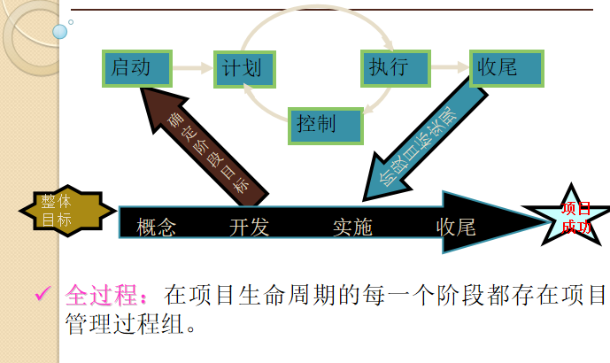
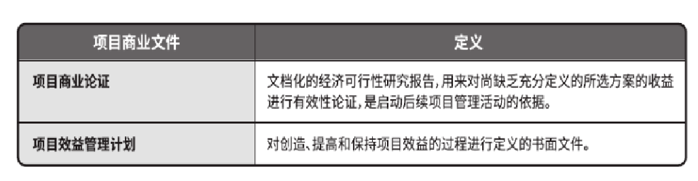

# 第三章：项目管理过程组

# 3.1 项目管理过程组

**过程：为实现某个特定目标而进行的一系列活动。**   
项目管理指的是对单个项目生命周期的管理，其管理者通常为项目经理（PMP）。也可以把项目管理看做是很多相互关联的过程组。  
项目管理过程组：是从启动到计划、执行、控制和收尾的一系列活动，即：**启动过程，计划过程，执行/实施过程，监控过程，收尾/终止过程**。

注意，项目管理过程组≠项目阶段（概念Conceive，开发Develop，实施 Execute，收尾Finish）。不同的项目有不同的项目阶段，但是所有的项目都包含这五个过程组。因此不可以将过程组与项目阶段等同起来。

​​

## 启动过程

启动过程是**识别、评价、确定、开始**一个新的项目或者开始一个项目的一个新阶段的过程。  
包括**定义和批准**一个项目或者项目阶段。  
启动过程在项目的**每个阶段都发生**。终止一个项目同样需要启动过程。

启动过程组按照主要成果的不同，可分为项目开始阶段的启动过程，和项目一个新阶段的启动过程。

1. **项目**​**开始阶段（这是哪个阶段？）**​**启动过程的主要成果：形成一个项目章程（第4章）和选择一位项目经理。**   
    在一个新项目的启动阶段，组织认可一个新项目的存在。完成**业务案例和项目章程**就能得到这种认可。这些文件（业务案例和章程）确认项目干系人，证明项目的正确性，规定高层的范围、时间和项目的成本目标（即三维）。  
    **项目经理和关键的团队成员**如果没有在**预启动过程**中被选择，通常也是在启动过程组的过程中被选择。
2. **项目一个新阶段启动过程的主要成果：对阶段进入条件的评估与确认。**

## 计划过程

计划过程包括制订和维护一个可执行的计划，以保证项目满足组织的要求。  
通常没有单一的“项目计划”。有几种项目计划：**范围管理计划、调度管理计划、成本管理计划和采购管理计划**等。

**计划过程组的成果：完成工作分解结构（WBS）和范围说明书、项目进度和项目成本估计（5-7章）。**

## 执行过程

执行过程包括协调人力和其他资源来执行项目的计划，以产生项目或者项目阶段的产品、服务或者结果。  
执行过程的例子包括**组织项目团队、指导和管理项目团队、执行质量保证、发布信息和选择供应商**。

确保：在执行过程中必须采取有效的措施和有力的行动来确保项目计划的顺利完成。  
交叉：在执行过程中将与其他过程组进行交叉，并消耗最多的资源。

*个人认为，确保和交叉也回答了为什么执行过程会消耗最多的资源。*

α认为执行过程占比69%，计划过程占比21%。

**执行过程组的主要成果：按计划完成项目工作，即项目实际工作的交付。**   

## 监控过程

监控过程包括有规律地测量和监视项目进程以保证项目团队能够满足项目目标。  
项目经理和项目成员监视和测量偏离计划的过程，在需要的时候采取正确的行动。  
通常的监视和控制过程是**绩效报告**，在这些报告中，项目的干系人能够识别任何需要的变化，从而保证项目没有偏离目标。  
一般的控制过程包括对绩效和状态进行评审。如果有必要进行某些变更，必须有人负责对这些变更进行识别、分析和监控。

**监控过程组的主要成果：通过交付满足时间、成本和质量约束的项目来成功地完成项目。**   
监控过程与其他的项目管理过程组有重叠（因为变更可以随时发生）。

## 首尾过程

收尾过程包括对项目或者项目阶段的正式验收，并有效地终止，使项目或项目阶段任务有序、圆满的完成。  
收尾过程涉及到许多管理活动，例如项目文件归档，完成合同，总结经验教训，同时作为阶段或者项目的一部分的交付工作而收到的正式确认。

**收尾过程组的主要成果：工作的正式验收以及项目审计和项目经验总结报告。**

# 3.2项目管理过程组与知识领域图解

可以将每个项目管理过程组的主要活动与10个知识领域联系起来。

|知识领域|启动过程|计划过程|实施过程|监控过程|收尾过程|
| ------------------| --------------| --------------------------------------------------------------------------------| ----------------------------------| ----------------------------| ----------------|
|项目集成管理|制定项目章程|制定项目管理计划|指导和管理项目实施、项目管理知识|监控项目工作、整体变更控制|结束项目或阶段|
|项目范围管理||规划范围管理、需求收集、范围定义和创建工作分解结构||范围核实、范围控制||
|项目进度管理||规划进度管理、活动定义、活动排序、（活动资源估算）、活动时间估算、制定进度计划||进度控制||
|项目成本管理||规划成本管理、成本估算、成本预算||成本控制||
|项目质量管理||规划质量管理|实施质量保证|实施质量控制||
|项目人力资源管理||规划人力资源管理|项目团队组建、项目团队建设|项目团队管理||
|项目沟通管理||规划沟通管理|管理沟通|监督沟通||
|项目风险管理||风险管理计划、风险识别、定性风险估计、定量风险分析、风险应对计划|实施风险应对|风险监控||
|项目采购管理||采购与获取计划、发包计划（采购规划）|询价、选择卖方（采购实施）|采购控制|采购终止|
|项目相关方管理|识别相关方|通过用新信息逐渐细化计划而控制(规划相关参与方)|管理相关方参与|监督相关方参与||

由表可知，大多数项目管理流程出现在计划过程组；所有的管理过程组活动都是项目集成管理知识领域的一部分。

# 3.3开发IT项目管理的方法论

**方法论：具体表述该怎么去做事情，并且不同的组织通常有不同的方式。**   
六西格玛项目和RUP（统一软件开发过程）框架也使用了项目管理方法论。

# 3.4案例研究:JWD咨询公司项目管理局域网网站项目

*重点掌握预启动及启动的知识，之后的过程组会在第4章介绍。*

## 项目预启动及启动

主要的目的：**正式选择并开始项目（选择项目考虑的因素：战略目标、 高回报率，后续章节会提及）** 。

### 预启动

在项目正式启动之前，高级经理需要完成的任务。

任务主要包括以下内容：决定项目的范围、时间和成本的约束因素；确定项目发起人；选择项目经理；为项目开发一个商业论证；与项目经理开会讨论项目管理过程以及预期成果；确定项目是否应该分成两个或以上小项目。

### 启动

启动项目包括识别和开始一个新项目或者项目阶段（可参考前文）。

**主要任务：识别利益相关者和制定项目章程。**

在启动过程中，定义初步**项目范围**和落实初步**财务资源**，识别那些**将相互作用并影响项目总体结果的相关方**，指派**项目经理**（如果尚未安排）。这些信息应反映在**项目章程**和相关方登记册中。

主要作用：确保只有符合组织战略目标的项目才能立项，以及在项目开始时就认真考虑商业论证、项目效益和相关方。

业务包括**潜在风险和展示**。

​​

### 输入​​

1. 商业文件

    ​​

    1. 商业论证

        从商业视角描述必要的信息，并且据此决定项目的期望结果是否值得所需投资。

        包含商业需求和成本效益分析。

        需求评估通常在商业论证之前进行。
    2. 项目效益管理计划

        描述项目效益的实现方法和时间及其衡量方式。

        包括：目标效益，战略一致性，实现效益的时限（包括短期效益、长期效益和持续性效益），效益责任人，测量指标，风险。​
2. 协议
3. 事业环境因素
4. 组织过程资产

### 工具与技术

1. 专家判断
2. 数据收集

    包括但不限于**头脑风暴、焦点小组、访谈**。  
    头脑风暴：在短时间内获得大量创意，适用于团队环境，需要引导者进行引导。由创意产生和创意分析2部分构成。  
    焦点小组：召集相关方和主题专家讨论项目风险、成功标准和其他议题，比一对一访谈更有利于互动交流。  
    访谈：指通过与相关方直接交谈来了解高层级需求、假设条件、制约因素、审批标准以及其他信息。（一对一）
3. 人际关系与团队技能

    包括但不限于**冲突管理，引导，会议管理**。  
    冲突管理：有助于相关方就目标、成功标准、高层级需求、项目描述、总体里程碑和其他内容达成一致意见。  
    引导：有效引导团队活动成功以达成决定、解决方案或结论的能力。引导者确保参与者有效参与，互相理解，考虑所有意见，按既定决策流程全力支持得到的结论或结果，以及所达成的行动计划和协议在之后得到合理执行。  
    会议管理：会议管理包括准备议程、确保邀请每个关键相关方群体的代表，以及准备和发送后续的会议纪要和行动计划。
4. 会议

    与关键相关方举行会议。

    目的：识别项目目标、成功标准、主要可交付成果、高层级需求、总体里程碑和其他概述信息。

### 输出

1. 项目章程

    **项目章程获得批准是项目正式立项、项目经理有权将组织资源的标志**。
2. 假设日志

    用于记录整个项目生命周期中的所有假设条件和制约因素。

‍

## 项目计划

主要目的：**指导项目的执行（多轮反馈 渐进明细）** 。

### 输出

输出包括：团队章程，项目范围说明书，工作分解结构，项目基准甘特图，风险排序清单。

基准甘特图只是表示计划，不能用于项目跟踪。

## 项目实施

采取必要的行动以确保完成项目计划中的活动。  
**花费最多的时间和资源。**

‍

‍

## 项目监控

针对项目目标衡量进展情况的过程。监控是否与计划有偏离, 并采取纠正措施使项目进展与计划相符。  
影响所有的**过程组**, 贯穿整个**项目周期**。  
输出包括**绩效报告、变更请求和对不同计划的更新**。

## 项目收尾

# 本章小结

项目管理可以被视做一系列相互关联的过程，5个项目管理过程组分别是**启动、规划、实施、监控和收尾**。  
每个过程组的主要活动可以与10个知识领域对应。  
一些组织开发了他们自己的信息技术项目管理方法论。  
JWD案例演示了一个使用项目管理组的例子, 并显示了几个重要的项目文档。

# 快速测试

//TODO

# 课堂讨论

//TODO

‍
