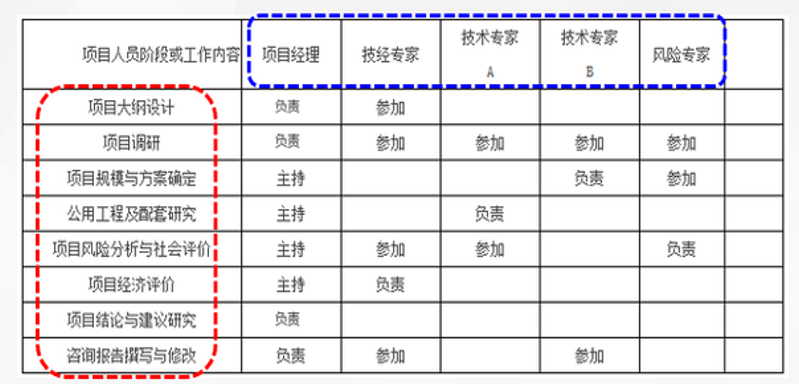
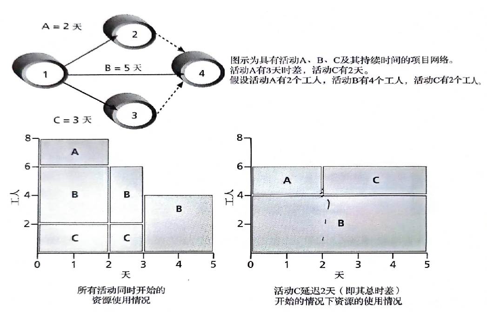
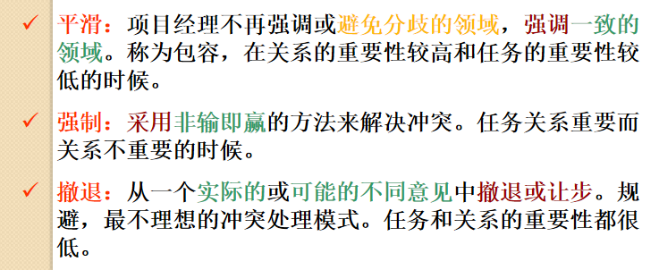

# 第九章 ：项目人力资源管理

4个过程组：人力资源规划，组建项目团队，建设项目团队，管理项目团队（前1计划过程，中2实施过程，后1监控过程）

# 9.1 人力资源管理的重要性

# 9.2  项目人力资源管理概述

**人力资源的含义**：人类可用于生产产品或提供各种服务的活力、技能、知识和可提供的商誉价值。*不仅仅等于“员工”。*

**人力资源的特点：可再生的生物性、居于主导地位的能动性、有时效性。**

**项目人力资源管理定义**：根据项目目标，采用科学的方法，对项目组织成员进行合理的**选拔、培训、考核、激励**，使其融合到组织之中，并充分发挥其潜能，从而保证高效实现项目目标的过程。

# 9.3  管理员工的关键所在

## 激励理论

内在动机：驱使人们为满足**自身的乐趣**而参与某项活动。

外在动机：驱使人们为**获得利益或者避免惩罚**而参加一些活动。

1. **马斯洛的需求层次理论：生理需要**，安全需要，社会需要，尊重需要，**自我实现**。
2. **赫茨伯格的双因素理论**：在考虑工作激励时区别了**激励因素和保健因素**，把影响工作满意的因素称为激励因素，把导致不满的因素称为保健因素。
3. 麦克赖兰的后天需要论：个人的需求是通过后天培养或者长期学习、由生活经验形成的。获取需求理论包括：成就需求、亲和需求和权力需求。
4. 麦格雷戈的X理论和Y理论：关于人们工作源动力的理论。这是一对完全基于两种完全相反假设的理论，X理论认为人们有消极的工作源动力，而Y理论则认为人们有积极的工作源动力。

## 权利理论

权力是一种影响行为的潜在能力。

*给出例子，知道是以下哪个类别。*

1. 强制权力：*威胁强迫员工参与活动*
2. 合法权力：*法律规定员工参与活动。*
3. 专家权力：*拥有专家力量的人被视为可靠且有影响力的信息和指导来源。*
4. 奖励权力：*项目经理提供员工奖励的权力。*
5. 参照权力（感召权力）：*通过感召力影响员工参与。*

# 9.4   项目人力资源管理过程

# 9.5  人力资源规划1

定义：包括识别和记录项目角色、责任和汇报关系。产生项目的组织结构图和人员配置管理计划，以及在责任分配矩阵中明确各人的角色和责任。*涉及到组织结构图和WBS。*

除了制定组织的结构图外，**工作解释和分配**的步骤同样重要。

## 输入、工具与技术和输出

​​

### 工具与技术

1. 组织机构图（OBS）：一种特殊的组织结构图。显示每个组织单元负责哪项工作。

    ​​​

### 输出

1. **责任分配矩阵（RAM）** ：将WBS中的项目工作和OBS中负责实施的人员相匹配的矩阵。除了可以分配细分的工作活动外，还可以用于定义项目的通用角色和责任。​

    ​
2. 人力资源管理计划（人员配置计划）

    通常包含一个项目进行过程中每个阶段分配的资源数量的资源直方图。

    **资源直方图：一段时间内分配给项目的资源数量。**

    ​​

# 9.6  组建项目团队2

*选拔、培训、考核、激励中的选拔。*

## 输入、工具与技术和输出

​​

### 工具与技术

组建的主要途径：人员预先指派，谈判，虚拟团队，招募。

### 输出

**最有效地使用项目人员的方法：资源负荷和资源平衡。**

1. 资源负荷：是指**在特定时段现有进度计划所需的个体资源的数量**。

    资源直方图。
2. 资源平衡：是一种通过**延迟任务**来解决资源冲突的工具，其主要目的是更合理地分配使用的资源。在允许的时差内移动任务，使得各时段的资源负荷变化达到最小。

    *如下图所示，将C延迟2天，使各时段的资源负荷变化达到最小。*

    ​​

    优点：

    1. 当资源的使用情况较稳定时，需要的管理较少。
    2. 可以使项目经理针对分包商或其他昂贵资源采取零库存 *（需要的时候再请过来，不需要就先不请）* 策略。
    3. 可以减少财务部与项目人员的一些问题。
    4. 可以提高士气。

# 9.7  开发项目团队3

*选拔、培训、考核、激励中的培训等。*

定义：层次合理、分工明确、任务清晰、责任到位，能将有限资源最有效的整合的机构—团队。

目标：团队开发的主要目标就是帮助人们更有效地一起工作来提高项目绩效。

塔克曼模型：帮助员工有效地一起工作去改善项目绩效。**5个阶段：形成、震荡、规范、成熟、解散。**

1. 形成阶段：指导性领导。
2. 震荡阶段：影响型领导。
3. 规范阶段：参与式领导。
4. 成熟阶段：委任式领导。
5. 解散阶段：任务完成，团队解散。

# 9.8  管理项目团队4

*处理冲突。*

## 输入、工具与技术和输出

​​

### 工具与技术

冲突管理：

项目进程中平均冲突强度中最强的是**项目进度冲突**。

**5+1种冲突解决方法：**

*题目给一个具体情况，要能分析出关系和任务的重要程度，给出解决方法。*

​​

​​

 **（新的1种）协作**：决策者结合不同的观点和见解来达成共识和承诺。

# 9.9  运用软件帮助做好人力资源管理

# 快速测试

题目

//TODO

答案

> 1.内在动机  
> 2.生理 自我实现  
> 3.感召（参照）  
> 4.责任分配矩阵（RAM）  
> 5.形成、震荡、规范、成熟、解散
