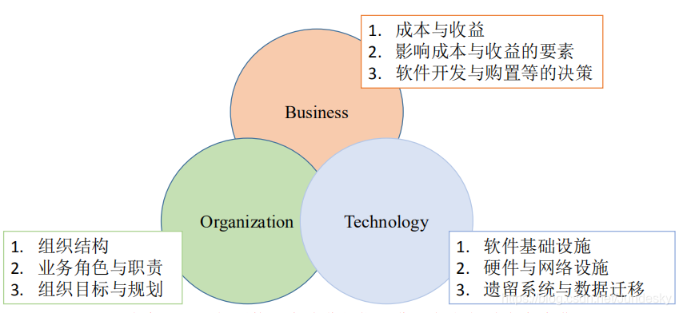
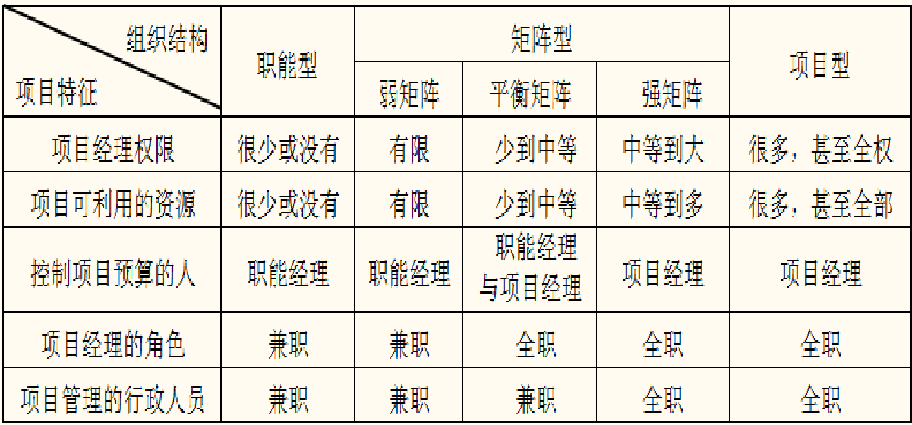
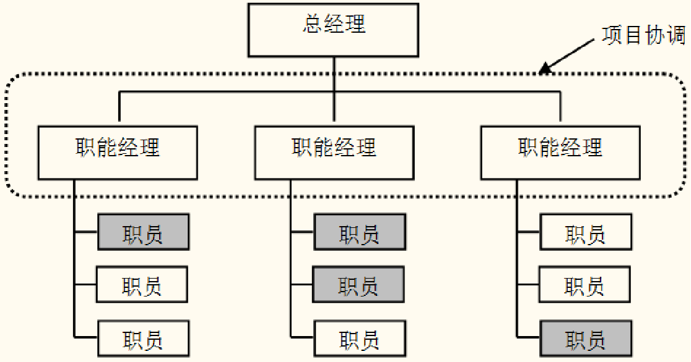
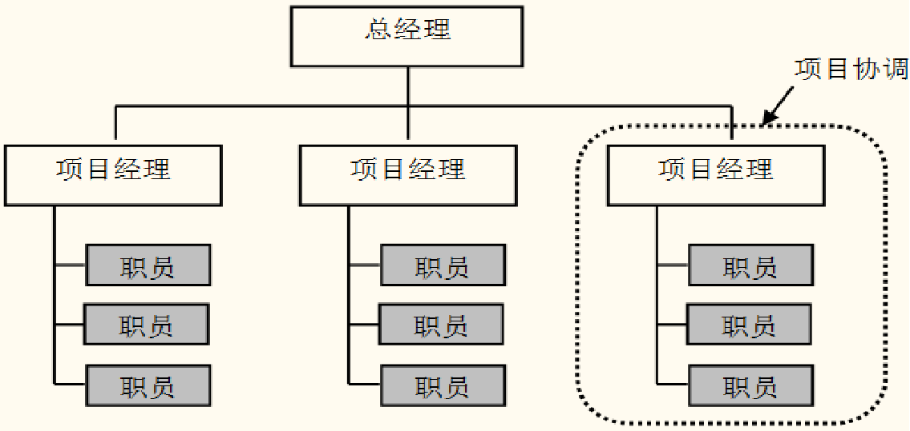
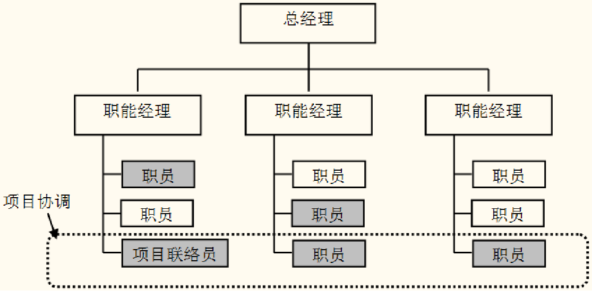
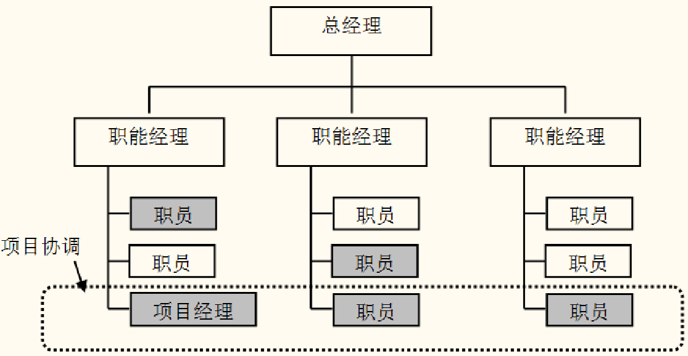
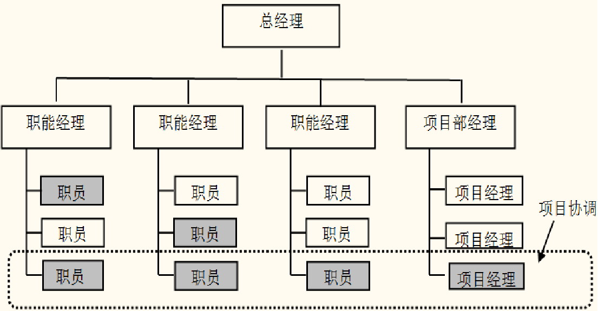
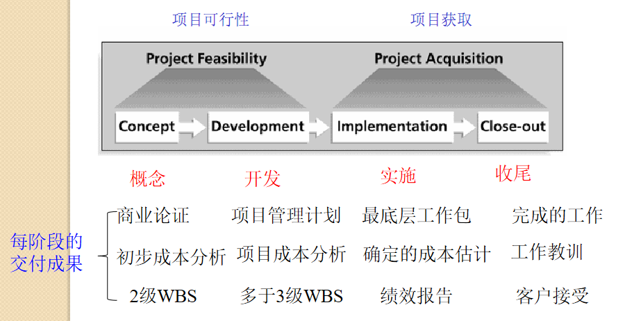

# 第二章：项目管理与信息技术环境

# 2.1 项目管理的系统观点

## 系统方法

包括三部分：**系统哲学，系统分析，系统管理**。

1. 系统哲学：将事情作为系统考虑的整体模型。
2. 系统分析：解决问题的方法（需要定义系统的范围、将其分解为各个组成部分，然后识别和估计问题、机会、约束和需求）。

    要素：目的和目标，方案，费用和效益，模型，评价标准。

    步骤：明确问题，目标选择，系统方案的形成，系统分析（建立模型），系统选择（最优化），决策，实施。
3. 系统管理：解决与系统的创建、维持和变更相关的业务上、技术上和组织上的问题。

    三维模型：business业务，organization组织，technology技术。

    ​​

# 2.2 组织

## 组织视角

组织的4个框架：**结构框架，人力资源框架，政治框架，标志框架**。

1. 结构框架

    用来解决组织结构化的问题。着眼于不同部门的角色、责任，以满足最高管理层设定的目标和政策，**重点用于协调、控制**。
2. 人力资源框架

    重点在于促成组织需求和个人需求之间的**平衡与协调**。
3. 政治框架

    处理组织和人的政治问题。假定组织是由各种人和利益集团组成的联合体。**冲突和权力是中心问题**。
4. 标志框架  
    主要指与事件相关的符号和含义。**文化很重要**。

## 组织结构

3种基本的组织结构：**职能型，项目型，矩阵型**。

*可参考*​*[三豪 | 项目管理的3种组织结构盘点：职能型、项目型、矩阵型 - 知乎 (zhihu.com)](https://zhuanlan.zhihu.com/p/455331319)*

​​

1. 职能型

    职能经理向CEO汇报。

    ​​
2. 项目型

    项目经理对CEO负责。

    ​​
3. 矩阵型

    介于职能型组织和项目型组织之间，需要向两个或多个上级汇报。分为**弱矩阵、平衡矩阵和强矩阵**。

    1. 弱矩阵型组织

        ​​
    2. 平衡矩阵型组织

        ​​
    3. 强矩阵型组织

        ​​​​

## 组织文化

组织文化是刻画组织机能的一系列**共享的假设、价值观和行为**。

当组织文化中的**特征被强调**，且其他特征保持平衡的情况下，项目工作是最成功的。

# 2.3 利益相关者管理

项目经理必须花时间识别、理解和管理**与所有利益相关者的关系**。  
应用**组织的4个框架（结构框架，人力资源框架，政治框架，标志框架）** 可以帮助满足利益相关者的需求和期望。  
高级管理层是**非常重要**的利益相关者。

高层支持的重要性：

一些研究认为高级管理层的参与和支持是关系项目成败的关键。  
高层支持有助于项目经理：获得足够资源；及时获得项目特殊需求的审批；得到组织其他部门人员的协作；学习如何成为出色的领导者。

# 2.4 项目阶段和项目生命周期

生命周期：项目都需要经历一个**从开始到结束的时间过程**，项目工作在这一过程中呈现出一定的**阶段性**的特征。

项目生命周期是项目阶段的集合。

可交付成果：指作为项目一部分制造或提供的产品或服务。

## 项目阶段

4个项目阶段：**概念Conceive，开发Develop，实施 Execute，收尾Finish**（简称CDEF阶段）。

前两个阶段（**概念和开发**）主要工作是做计划，称做**项目可行性阶段**。后两个阶段（**实施和收尾**）主要是开展实际工作，称做**项目获取阶段**。

1. 概念阶段

    主要任务是制定高水平的总体计划/总体方案/项目建议书。它主要描述为什么要做，做什么。
2. 开发阶段

    主要任务是规划项目怎么做，谁来做。项目组要根据总体计划/总体方案，制定出更为详细的项目计划/项目规划。

    项目计划是项目实施的蓝本，并给出更为准确的成本估算和更为详细的工作分解结构（WBS）。
3. 实施阶段

    主要工作是执行项目计划，并进行项目的监督和控制。其目的就是把计划/规划中的内容完成。这是一个从无到有的过程。
4. 收尾阶段

    主要任务完成项目的验收与工作总结，为后续的项目提供经验、教训和帮助。

​​

‍

‍

## 产品生命周期

产品生命周期：是定义、开发、交付产品的过程。  
系统开发生命周期：是用来描述系统开发不同阶段的框架，包括计划，分析，设计，实施，维护。

在确定使用哪种生命周期时，考虑2个重要因素：需求的变化程度，有用成果的交付频率。

生命周期种类：瀑布模型，螺旋模型，增量建构模型，原型模型，快速应用开发模型。

## 项目阶段和管理评审的重要性

每个项目在继续下一阶段之前, 都必须顺利通过前面的每个项目阶段或产品阶段。**管理评审**被称为阶段出口或终止点。

# 2.5 IT项目环境

## 影响IT项目管理的最新趋势

离岸外包：外包商与其供应商来自**不同国家**，外包工作**跨国**完成。

虚拟团队：在虚拟的工作环境下，由进行实际工作的真实的团队人员组成，并在虚拟企业的各成员相互协作下提供更好的产品和服务。

# 本章小结

> 项目经理在从事项目时需要采用系统的方法  
> 组织有四个框架: 结构、 人力资源、政治、标志  
> 项目经理要获得成功就必须了解组织的各个方面，组织结构和组织文化对项目经理有强烈的影响  
> 项目生命周期的每一个阶段都存在项目管理工作  
> 项目必须顺利通过每一个项目阶段评价才能得以继续  
> 鉴于IT项目的独特环境, 项目经理需要考虑多种因素

# 快速测试

> 1.（   ）是作为项目的一部分所提供的一件产品或者服务。  
> 2.阶段出口又叫做（   ）点。  
> 3.人员在（   ）组织结构中通常向两个或更多的上级报告。  
> 4. 组织4个框架中，（  ）涉及如何举行会议、员工衣着样式和预期工作时间。  
> 5. 系统管理的三维模型有（   ）、（   ）、（     ）。

答案

> 1.可交付成果
>
> 2.终止点【管理评审被称为阶段出口或终止点】
>
> 3.矩阵型
>
> 4.业务 组织 技术

# 课堂讨论

> 1、什么是以系统的眼光看待项目？如何将以系统的眼光看待项目的方法应用于项目管理？
>
> 2、解释组织的4个框架，他们如何帮助项目经理理解他们开展项目所处的组织环境的？
>
> 3、简述职能型、矩阵型和项目型组织之间的区别，描述每种组织是如何运作项目管理的。

GPT生成答案

> 1、以系统的眼光看待项目意味着将项目视为一个整体系统，考虑到项目的各个组成部分之间的相互作用和影响。这包括了项目的目标、范围、资源、风险等各个方面。在项目管理中，应用系统的眼光意味着不仅仅关注项目的局部部分，而是将项目作为一个整体来思考和管理。这可以通过系统工程的方法来实现，包括系统分析、系统设计、系统集成等。项目经理可以通过制定系统化的项目管理计划，明确项目的整体目标和各个子系统之间的关联，以及相互作用，从而更好地管理项目的执行过程，确保项目的成功实施。
>
> ‍
>
> 2、组织的四个框架包括：结构、人力资源、政治和标志框架。
>
> * 结构框架：用来解决组织结构化的问题。着眼于不同部门的角色、责任，以满足最高管理层设定的目标和政策，**重点用于协调、控制**。
> * 人力资源框架：重点在于促成组织需求和个人需求之间的**平衡与协调**。
> * 政治框架：处理组织和人的政治问题。假定组织是由各种人和利益集团组成的联合体。**冲突和权力是中心问题**。
> * 标志框架：主要指与事件相关的符号和含义。**文化很重要**。
>
> 这四个框架帮助项目经理理解他们开展项目所处的组织环境的方式在于以下几点：
>
> 1. **提供全面视角**：每个框架从不同的角度解析组织环境，包括结构、人力资源、政治和文化等方面。项目经理通过综合考虑这些框架，可以获得更全面的组织环境认知，有助于更好地规划和执行项目。
> 2. **识别关键因素**：每个框架都突出了组织环境中的关键因素。结构框架帮助项目经理理解组织的层次结构和职能划分，人力资源框架帮助项目经理了解团队成员的能力和需求，政治框架帮助项目经理识别组织内部的利益冲突和权力关系，标志框架帮助项目经理理解组织的文化和价值观。通过理解这些关键因素，项目经理能够更准确地评估组织环境对项目的影响，采取相应的应对措施。
> 3. **预测和应对挑战**：这些框架有助于项目经理预测和应对组织环境中可能出现的挑战。例如，通过政治框架可以预测到可能的利益冲突和权力斗争，通过人力资源框架可以预测到可能的团队动力问题，通过结构框架可以预测到可能的沟通和协作障碍等。项目经理可以根据这些预测，制定相应的应对策略，降低项目风险。
> 4. **优化资源配置**：了解组织环境有助于项目经理优化资源配置，提高项目执行效率。通过结构框架了解组织的层次结构和职能划分，可以更好地协调资源；通过人力资源框架了解团队成员的能力和需求，可以更好地分配任务和角色；通过政治框架了解组织内部的利益关系，可以更好地调解冲突和协调资源分配。
>
> ‍
>
> 3、职能型、矩阵型和项目型组织之间的区别在于它们的组织结构、权力分配和项目管理方法：
>
> * 职能型组织：以职能部门为基础组织结构，项目经理在组织中并不拥有直接的权力，而是通过协调各个职能部门的资源来完成项目。项目管理相对分散，项目经理通常是部门经理或高级管理层成员。
> * 矩阵型组织：结合了职能型和项目型的特点，项目经理在组织中拥有一定程度的权力，可以直接管理项目团队，并且可以从职能部门调配资源。项目经理和部门经理之间存在双重上级关系。
> * 项目型组织：以项目为基础组织结构，项目经理在组织中拥有最高的权力，直接管理项目团队和项目资源。组织的其他部门和职能都围绕着项目而存在，项目完成后可以解散或者转移到其他项目上。

‍
