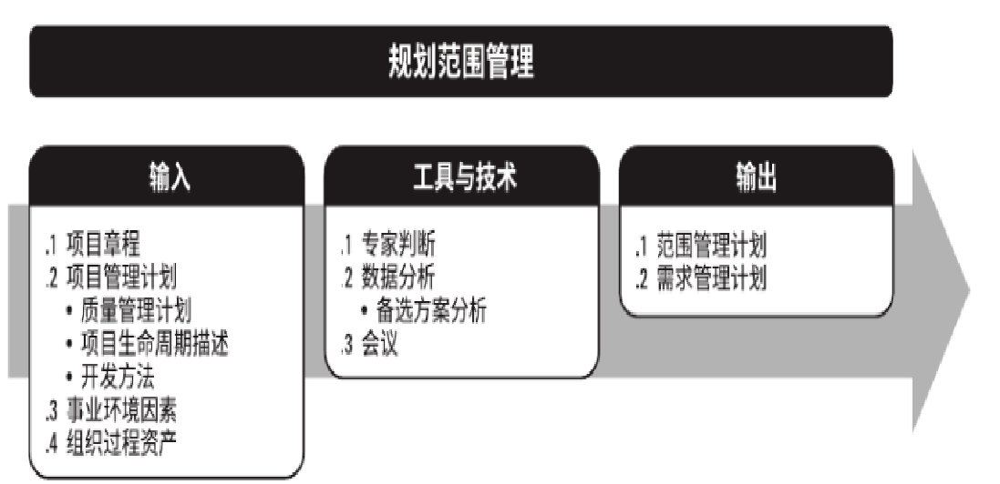
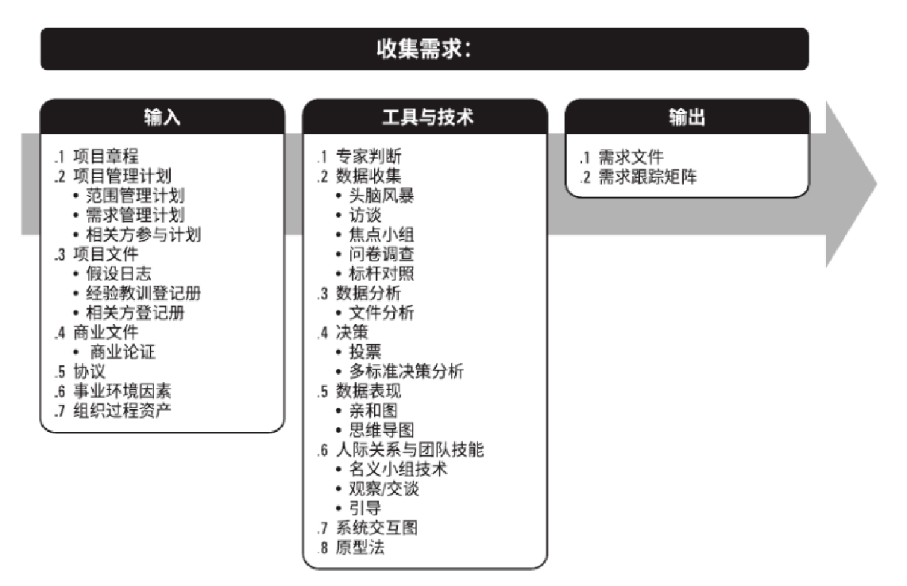
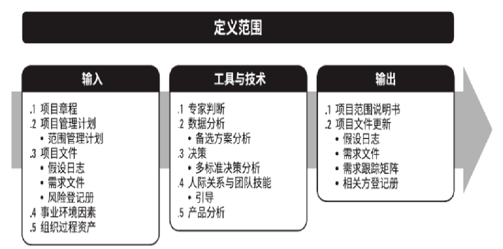
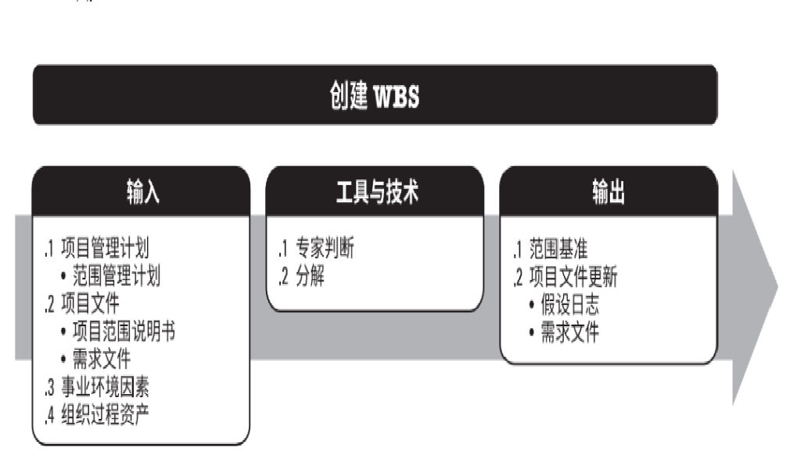
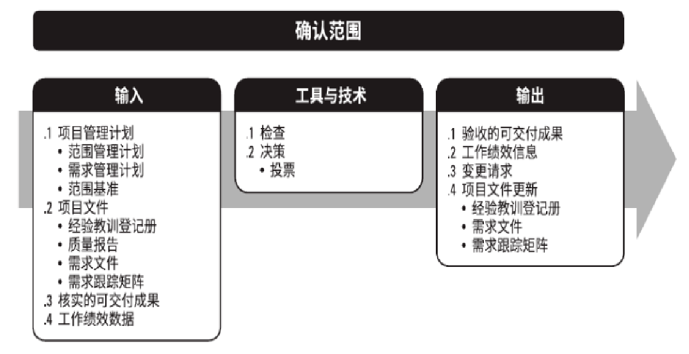
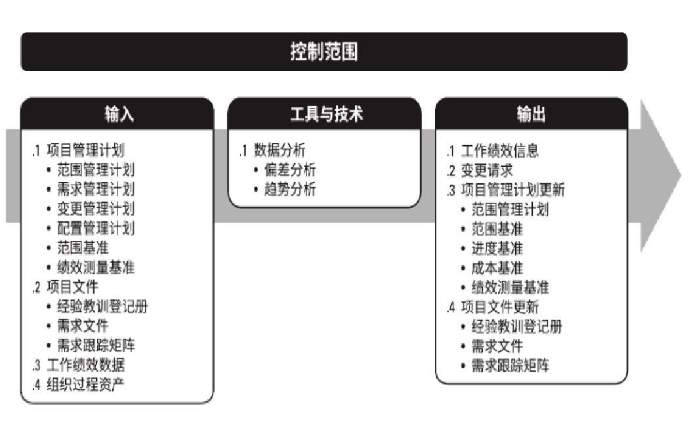
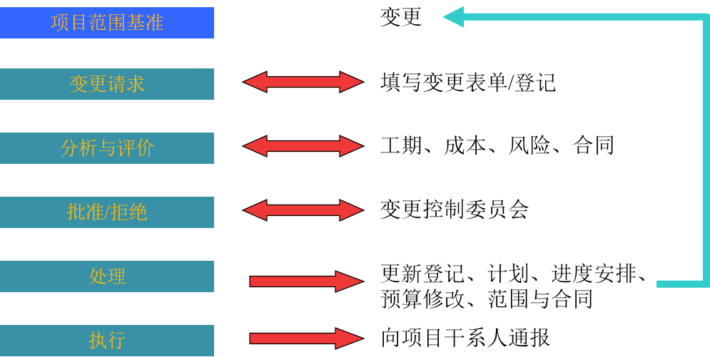

# 第五章：项目范围管理

六大过程：规划范围管理，收集需求，范围定义，创建工作分解结构，范围核实，范围控制（前4计划过程，后2监控过程）

# 5.1 项目需求与范围管理的重要性

软件企业对三类人（需求专家、概要设计专家、咨询专家）的获取和培养，以及项目应用企业对项目范围三要素（企业需求、管理理论、竞争压力）的有效把握，是软件企业与IT项目应用企业信息化成功的基本保证。

# 5.2 项目范围管理相关概念

## 项目范围与产品范围

### 项目范围

定义：开展项目产品所包括的所有工作及产生这些产品经过的所有过程。

主要内容包括：

1. 工作分解结构(WBS)：将项目工作细分为可管理和可控的小任务。
2. 里程碑：项目的关键时间点和重要事件。
3. 资源分配：项目所需的人员、资金、设备和材料。
4. 风险管理：识别、评估和控制项目风险的计划。

### 产品范围

与项目相关的特定产品、服务或成果的功能和特性。在信息系统项目中，产品范围可以包括软件应用程序的特定功能、系统的性能标准、技术规格和数据要求等。产品范围的定义通常包含在产品需求文档或系统需求规格(SRS)中。

### 联系

1. 都是确保项目成功的关键要素。
2. 产品范围直接影响项目范围，因为产品的功能和特性需求将决定必须完成哪些工作。
3. 项目范围的制定和管理是为了确保满足产品范围的要求。

### 区别

1. 产品范围关注的是**最终交付的产品或服务的特性和功能**，而项目范围关注的是实现这些产品或服务**所需的工作**。
2. 产品范围的变更**通常影响**项目的成本和时间线，而项目范围的变更**可能不直接影响**产品的功能或特性。
3. 产品范围的定义和变更通常需要**客户或利益相关者**的密切参与，而项目范围管理更多是**项目团队**的责任。
4. 先确定产品范围，后确定项目范围。
5. 产品范围主要由项目**发起人和客户**确定，项目范围主要由**项目经理和项目管理团队**确定。
6. 产品范围的完成对照产品要求；项目范围的完成对照项目计划。

# 5.3 **范围规划**和范围**管理**计划（计划过程）

定义：为记录如何定义、确认和控制项目范围及产品范围，而创建范围管理计划的过程。

主要作用：在整个项目期间对如何管理范围提供指南和方向。本过程仅开展一次或仅在项目的预定义点开展。

## 输入、工具与技术和输出

​​

范围管理计划：描述将如何定义、制定、监督、控制和确认项目范围。

需求管理计划：描述将如何分析、记录和管理项目和产品需求。

# 5.4 **收集需求**（计划过程）

定义：为实现项目目标而确定、记录并管理干系人的需要和需求的过程。

主要作用：为定义和管理项目范围（包括产品范围）奠定基础。

且仅开展一次或仅在项目的预定义点开展。

## 输入、工具与技术和输出

​​

### 工具与技术

1. 标杆对照

    将实际或计划的产品、过程和实践，与其他可比组织的实践进行比较，以便识别最佳实践，形成改进意见，并为绩效考核提供依据。标杆对照所采用的可比组织可以是内部的，也可以是外部的。
2. 文件分析

    包括审核和评估任何相关的文件信息。

    在此过程中，文件分析用于通过分析现有文件，识别与需求相关的信息来获取需求。有助于获取相关需求的文件很多。
3. 决策技术

    分为**独裁型决策制定和多标准决策分析**。本处是多标准决策分析。

### 输出

1. 需求文件

    描述各种单一需求将如何满足与项目相关的业务需求。

    需求类别包括：业务需求，相关方需求，解决方案需求，过渡和就绪需求，项目需求，质量需求。
2. 需求跟踪矩阵

    把产品需求从其来源连接到能满足需求的可交付成果的一种表格。

    ‍

# 5.5 **范围定义**和项目范围说明书（计划过程）

定义：制定详细的项目范围说明书，供将来的项目决策作为依据的过程。

## 输入、工具与技术和输出

​​

# 5.6 **创建工作分解结构**（计划过程）

## 工作分解结构

**以结果为导向的分析方法，面向可交付成果的层次分解。**

## 输入、工具与技术和输出

​​

### 输出

1. 范围基线

    由**项目范围说明书及相关的WBS、WBS字典**构成。
2. **WBS字典**

    **描述WBS每项条目详细信息的文件**，一般包含工作包的描述。

    工作包：WBS的最低一层元素。

# 5.7 **范围确认/验证/核实**（监控过程）

定义：进入项目实施阶段以后，**项目利益相关者**对项目范围的正式认可和接受（或可以进入下一阶段）的过程。

## 输入、工具与技术和输出

​​

# 5.8 **范围控制**（监控过程）

定义：监督项目和产品的范围状态，管理范围基准变更的过程。

主要作用是：在整个项目期间保持对范围基准的维护，且需要在整个项目期间开展。

目的：对那些引起项目范围变化的因素施加影响，确保变更能依据集成变成控制建立的程序有序进行。

## 项目蔓延

**因素（先后排序）：缺少用户参与，不完整的要求和说明，易变的要求和说明。**

用户的参与、支持与理解是确定与控制范围的关键所在。

### 输入、工具与技术和输出

​​

## 范围变更控制

定义范围变更控制的程序、方法和管理规范。

范围变更控制系统：定义范围变更控制的程序、方法和管理规范。

范围变更控制过程：

​​

‍

# 快速测试

题目

//TODO

答案

> 1.范围管理
>
> 2.WBS
>
> 3.范围定义
>
> 4.范围核实
>
> 5.控制范围基线
>
> 6.WBS字典

# 课后讨论

//TODO

‍
