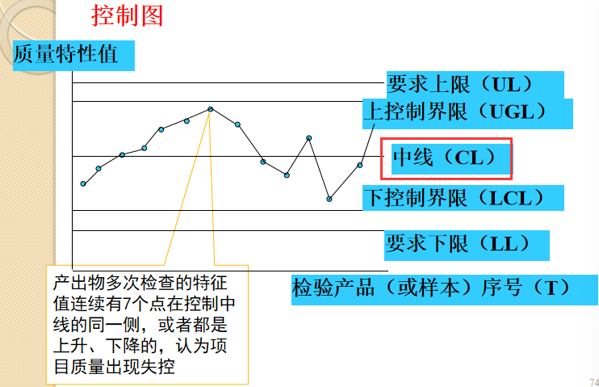

# 第八章：项目质量管理

4个过程组：规划质量管理（计划过程）、实施质量保证（实施过程）、实施质量控制（监控过程）

# 8.1  软件质量

产生软件质量问题的原因

​​

​​

# 8.2  软件项目质量管理

1. 传统的认识

    1. 符合性质量（生产者角度）

        克劳斯比，戴明。
    2. 适用性质量（用户角度）

        朱兰。
2. 新的认识

    满意性质量：全面顾客满意。

    **质量≠等级**。

PMI定义：质量是满足双方一致同意的客户需求。

ISO定义：质量是反映实体满足明确和隐含需要的能力的特性总和。

# 8.3  软件项目质量管理过程

​​

# 8.4  现代质量管理

质量管理经历了4个阶段。

1. 传统质量管理阶段：以**检验**为基本内容，方式是严格把关。
2. 统计质量控制阶段：以**数理统计**方法与质量管理相结合，通过对过程中影响因素的控制达到控制质量的目的。
3. 全面质量管理阶段：以“三全为主要特征，即管理对象是**全面的、全过程的、全员的**。
4. 现代质量管理阶段：以顾客满意为中心，重视与企业职工、社会、交易伙伴、股东等顾客以外的利益相关者的关系。重视中长期预测与规划和经营管理层的领导能力。重视人及信息等经营资源，使组织充满自律、学习、速度、柔韧性和创造性。现代质量管理追求顾客满意，**注重预防而不是检查**，并承认管理层对质量的责任。

**戴明改进循环（PDCA循环）：计划、执行、检查、处理。需要明确的问题是5W1H。**

*不要和5M1E搞混淆。*

​​

特点：

1. 周而复始
2. 大环带小环
3. 阶梯式上升
4. 统计的工具

# 8.5  **质量规划** 1计划过程

定义：识别项目及其可交付成果的质量要求和/或标准，并书面描述项目将如何证明符合质量要求或标准的过程。

主要作用：为在整个项目期间如何管理和核实质量提供指南和方向。  

## 输入、工具与技术和输出

​​

### 工具与技术

1. 成本/收益分析法（经济质量法）

    质量成本：将产品质量保持在规定的质量水平上所需的费用。质量成本=一致性成本+不一致性成本

    ​​

    ​​
2. 质量标杆法

    利用其它项目质量管理结果或计划作为新项目质量参照体系和比照目标（标杆），通过对照比较制订出新项目质量计划的方法。
3. 项目质量图表法

    使用各种图表制定项目质量计划的方法。例如，项目系统流程图、项目工作流程图和因果图等等。
4. 实验设计法

    用实验的方法去识别项目质量及其影响因素，然后编制项目质量计划。

### 输出

1. 项目质量计划

    为确定项目应该达到的质量标准（项目质量的规定指标）和如何达到这些项目质量标准而做的项目质量的计划与安排工作。
2. **项目质量基线**

*朱兰、戴明：对质量的不断改进。*

# 8.6  **质量保证** 2实施过程

定义：项目质量保证是在项目执行过程中所开展的一系列经常性地对项目质量计划执行情况所进行的评估、核查和改进等活动，从而达到质量要求的项目质量管理工作。

**目标：确保项目质量计划的执行与实现，不断地对质量进行改进。**

## 输入、工具与技术和输出

*了解即可，上课没有细讲。*

​​

# 8.7  **质量控制** 3监控过程

​​

定义：对于项目质量实施情况的监督与管理，主要是质量的监控并找出能够消除不良情况的方法的过程，这包括项目产出物和项目工作两个方面的控制。

影响项目质量因素的控制：5M1E

*人和机械设备属于资源（资源还有材料和其他）。不要和质量规划戴明PDCA中的5W1H搞混。*

​​

## 输入、工具与技术和输出

​​

### 工具与技术（8.8）

老七种工具：**排列图（帕累托图）、因果图**、**控制图**、调查表、直方图、**散布图**、分层图。

新七种工具：关联图、统计图、矩阵图、箭条图、PDCA法、亲和图 *（分类）* 、矩阵数据分析法。

1. 帕累托图

    帕累托图是“根据优先次序表达信息的一种图形，能够**突出关键因素**，以引起必要的关注”。

    ​​

    ​​
2. 控制图

    七点定律：产出物多次检查的特征值连续有7个点在控制中线的**同一侧**，或者**都是上升、下降**的，认为项目质量出现失控。**如果失控，需要寻找非随机因素。**

    ​​
3. 因果图（鱼刺、鱼骨、石川图）

    用于原因—结果关系分析。寻找小原因、中原因、大原因。*这些原因之间没有直接关系。纵向的。*

    **纵向的：不注重因素之间的关联。**

    ​​
4. 关联图

    头脑风暴法。

    用于原因—结果关系分析。*复杂因素的交织，因素的横向关联。*

    **横向的：注重因果的关联。**

    ​​
5. 散点图（散布图）

    显示变量之间的相互影响程度。

    **可以显示两个变量之间是否有关系。数据点越靠近对角线，两个变量之间的相关性就越密切。**
6. 六西格玛（6σ）管理法

    **每百万**产品或服务或工作，只有**3.4**个瑕疵。

    降低**标准差**提高质量。

    改进模式：DMAIC（定义、评估、分析、改进、控制）。
7. 测试

### 输出

1. 接受决策
2. 返工
3. 过程调整

    主要进行预防和纠正。

# 8.9  提高软件项目质量

提高软件质量关键在领导。

应该注意改善工作环境以提高生产效率和质量。

成熟度模型：软件质量功能实施 (SQFD)模型，能力成熟度模型 (CMM)，项目管理成熟度模型。

​​

# 快速检测

题目

//TODO

答案

> 1. 质量
> 2. 质量标杆法
> 3. 散点图
> 4. 控制图
> 5. 3.4个
