# 第六章：项目进度管理

6个过程：规划进度管理、活动定义、活动排序、活动时间估算、制定进度计划，进度控制（前5计划过程，后1监控过程）

# 6.1 项目进度计划的重要性

## 概念

定义：采用一定的方法，对项目范围所包括的活动及其相互关系进行分析, 对各项活动所需要的时间和资源进行估算，并在项目的时间期限内合理地安排和控制活动的开始和结束时间。

目的：保证项目按照时间期限在预算成本内完成项目全部可交付物工作。

### 项目计划、进度计划和进度跟踪与控制

项目计划：指导项目实施和控制的一系列纲领性文件，是经高层管理批准的项目正式文档。

进度计划：表达项目中各项工作（活动）的开展顺序、开始及完成时间及相互衔接关系的计划。进度计划是进度控制和管理的依据；同时引导项目其他类型的计划工作。

项目进度计划制定：是根据项目的目标，在项目确定的范围内、依据确定的需求和质量标准、并在项目成本预算许可下，制定出一个周密的项目活动安排的过程。

进度跟踪与控制：在项目的执行和实施过程中，经常检查实际进度是否按计划要求进行，若出现偏差，便要及时找出原因，采取必要的补救措施或调整、修改原计划，直至项目完成的过程。

# 6.2 **规划进度管理**1（计划过程）

定义：确定将用于计划、执行和控制项目进度的政策、流程和文档。

制定贯彻整个项目生命周期的进度管理计划。项目进度源于启动项目的基本文档。（项目章程中的起止时间）

*进度管理计划是第一个过程的输出，这和最后一个过程的输出（进度计划）不一样。即：进度管理计划不等于进度计划。*

## 输入、工具与技术和输出

### 输入

管理计划、项目章程、企业环境因素和组织过程资产。

### 工具与技术

专家判断、分析技术和会议。

### 输出

进度管理计划。

# 6.3 **定义活动**2（计划过程）

活动或任务：项目进行期间需要完成的工作单元，它们有预期的历时、成本和资源要求。

活动的主要依据：项目章程、范围说明书、WBS和项目预算信息。

定义：识别和记录为完成项目可交付成果而须采取的具体行动的过程。

目标：是确保对项目范围有一个完整的理解。

主要作用：将工作包分解为进度活动，作为对项目工作进行进度估算、规划、执行、监督和控制的基础。

*活动在进度里，可交付成果在范围里。定义活动不在范围管理而是进度管理，是因为范围管理并未规定开始时间、结束时间；范围管理的可交付成果强调要做什么，活动（进度管理）强调什么时候做。*

## 输入、工具与技术和输出

​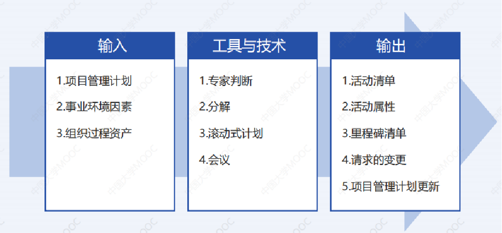​

**分解用于活动定义时，最后结果是Activities（活动）；分解用于范围定义时，最后结果为Deliverables（可交付成果）。** 

### 工具与技术

1. 滚动式规划

    在项目生命周期的不同阶段，工作的详细程度会有所不同。

    编制方法遵循“近细远粗”的原则，即近期计划详细，远期计划粗略。

### 输出

1. 活动清单

    包括项目将要进行的所有计划活动。

    可以看作是WBS的进一步延伸。

    一般附有编制说明，该编制说明至少包括所有的假设前提和限制条件。
2. 活动属性

    每项活动所具有的多种属性，用来扩充对活动的描述，活动属性随时间演进。
3. 里程碑清单

    项目中重要时点或者事件，列出了所有项目里程碑，并指明每个里程碑是强制性的。

    项目中的里程碑是一个通常没有持续时间的重要事件。

# 6.4 **排列活动顺序**3（计划过程）

## 活动排序

涉及详细审查WBS中的活动、详细的产品说明书、假设和约束条件，以决定活动之间的相互关系。它也涉及评价活动之间依赖关系的原因、及各种依赖关系。

定义：识别和记录项目活动之间的关系的过程。根据活动清单和依赖关系，安排项目活动的顺序和先后关系。

主要作用：定义工作之间的逻辑顺序，以便在既定的所有项目制约因素下获得最高的效率。

## 依赖关系或关系

反映了项目活动或任务的顺序。

分为强制和自由，外部和内部。

*给例子要会判断。*

1. 强制依赖关系（硬逻辑关系）：项目工作固有的特性(行业逻辑）。
2. 自由依赖关系（软逻辑关系）：由项目团队来定义的(是否签字）。
3. 外部依赖关系：涉及项目与非项目活动之间的关系（操作系统供应商）。
4. 内部依赖关系：涉及项目活动之间的关系（在项目团队控制之内）。

确定以上某种依赖关系后，再确定依赖环境的类型。同样分为4种。

*网络图（重点必考）会使用这个知识。*

[项目管理中，开始到完成、完成到开始、开始到开始、和完成到完成的关系都是什么意思？ - 知乎 (zhihu.com)](https://www.zhihu.com/question/36444597)

​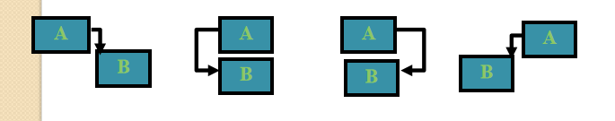​

1. 完成-开始：从活动（紧前活动）必须完成后，到活动（紧后活动）才能开始。
2. 开始-开始：从活动开始后，到活动才能开始。
3. 完成-完成： 到活动完成前，从活动必须完成。
4. 开始-完成： 从活动必须开始后，到活动才能完成。

    ‍

### 输入、工具与技术和输出

​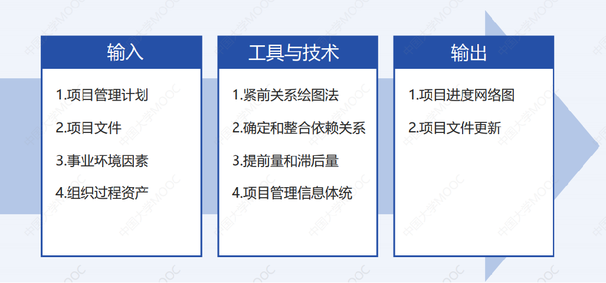​

### 工具与技术

1. 紧前关系绘图法（PDM）

    创建进度模型的一种技术。*其实不止PDM这一种，还有双代号网络图。这两种会在下面进行介绍。*

    节点表示活动，一种或者多种逻辑关系链接活动，以显示活动的实施顺序。

    1. 项目网络图 ：项目网络图是项目活动之间的逻辑关系或排序的图形显示。
    2. 表示方法：双代号网络图法（AOA）和单代号网络（AON）

        1. **箭线图法（ADM）或双代号网络图法（AOA）**

            ​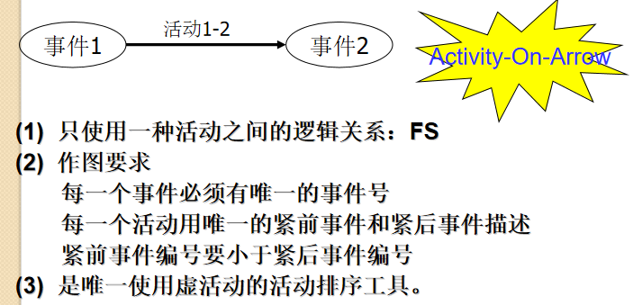​

            **箭线**表示活动，用节点表示活动间的相互依赖关系。

            只使用一种活动之间的逻辑关系：FS（完成开始）。

            唯一使用虚活动（辅助表示活动先后顺序）的活动排序工具。

            *活动不能交叉。顺序从左到右，编号从小到大。*

            ​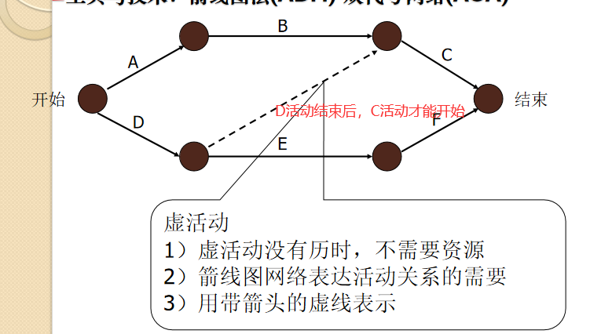​

            ​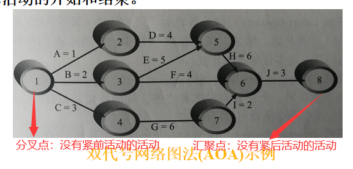​
        2. 前导图法或紧前关系绘图法（PDM）或单代号网络（AON）

            **节点**表示活动，箭线表示活动间依赖关系。

            4种关系都能表示（FS，FF，SS，SF）。

            ​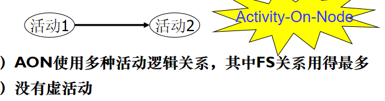​

            ​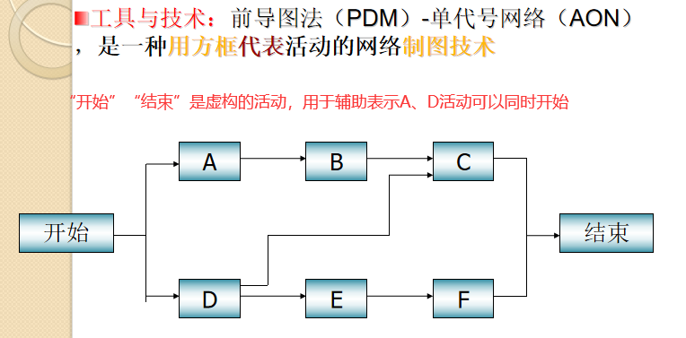​
2. 确定和整合依赖关系

    可能是强制或选择的，内部的或者外部的，这四种依赖关系可以组成强制性外部依赖关系、强制性内部依赖关系、选择性外部依赖关系和选择性内部依赖关系。
3. 提前量和滞后量

    活动间的2种逻辑关系。

    相对于紧前活动而言，​

    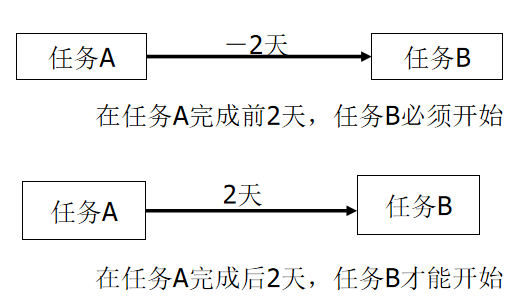​

    提前量：紧后活动可以提前的时间量。

    滞后量：紧后活动需要推迟的时间量。
4. 项目管理信息系统 

    包括进度计划软件，有助于规划、组织和调整活动顺序，插入逻辑关系、提前和滞后值，以及区分不同类型的依赖关系。

# 6.5 **估算活动持续时间**4（计划过程）

项目活动资源估算：分析和识别项目的资源需求，确定项目所需投入资源的**种类**、估计资源的**数量**和资源投入的**时间**​ *（什么时候能拿到资源）* 。

估算活动持续时间：根据资源估算的结果，估算完成单项活动所需工作时段数的过程。

主要作用：确定完成每个活动所需花费的时间量。

历时估算：估算完成项目每项活动所需要的时间，历时（持续时间）=（活动消耗的）实际时间+间歇时间。

## 输入、工具与技术和输出

​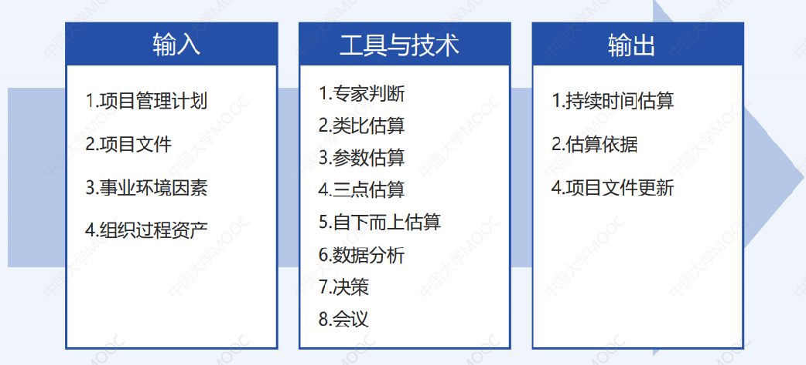​

## 工具与技术

1. 类比估算（自上而下估算）

     *《软件过程与改进》提到过（PSP）。*

    以过去类似项目的参数值（如持续时间、预算、规模、重量和复杂性等）为基础，来估算未来项目的同类参数或指标。

    当信息资源有限时（如项目的初期阶段），采用类比估算方法进行活动历时估算是非常有效的。

    **需要历史数据。**
2. 参数估算

    **需要历史数据。**
3. **三点估算**

     *《软件过程与改进》提到过。*

    *要会计算。*

    即计划评审法（PERT）。三点：乐观、最可能、悲观的。

    ​​

    **需要历史数据。**
4. 自下而上估算

    通过从下到上逐层汇总WBS组成部分的估算而得到项目估算。

# 6.6 【重点】**制定进度计划**5（计划过程）

定义：分析活动顺序、持续时间、资源需求和进度制约因素，创建进度模型，从而落实项目执行和监控的过程。

主要作用：为完成项目活动而制定具有计划日期的进度模型。

最终目标：建立一个现实的项目进度计划，为监控项目的时间进展情况提供一个基础。

方法：应用定义、排序、历时估算等过程得到的结果，制定进度计划，决定项目的开始日期和完成日期。

## 进度模型

本质上是一个时间模型，是对项目实施方案或计划的一个**动态**的时间上的反应。

*下图是单代号活动图（节点表示活动）*

​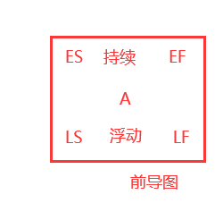​

1. 浮动时间（float）

    反映活动的机动性，是一个活动在不影响整个项目完成时间的情况下，可以延迟的时间量。因而，也称为最大的机动时间。

     TF＝LS－ES＝LF-EF
2. 自由浮动时间（free float）  
    是指可以在不推迟任何后续活动最早开始时间的情况下，本活动可以推迟的时间。一般情况下，FF＜TF。

    FF＝后续活动的ES－本活动的EF

    FF<TF
3. 活动属性

    在“定义活动”过程的输出活动清单中。

    包括“由谁执行该活动”、“地理位置或地点（在何处进行这项工作）”和“活动类型”，这些属性的描述可以帮助项目活动的排序和分类。

## 输入、工具与技术和输出

​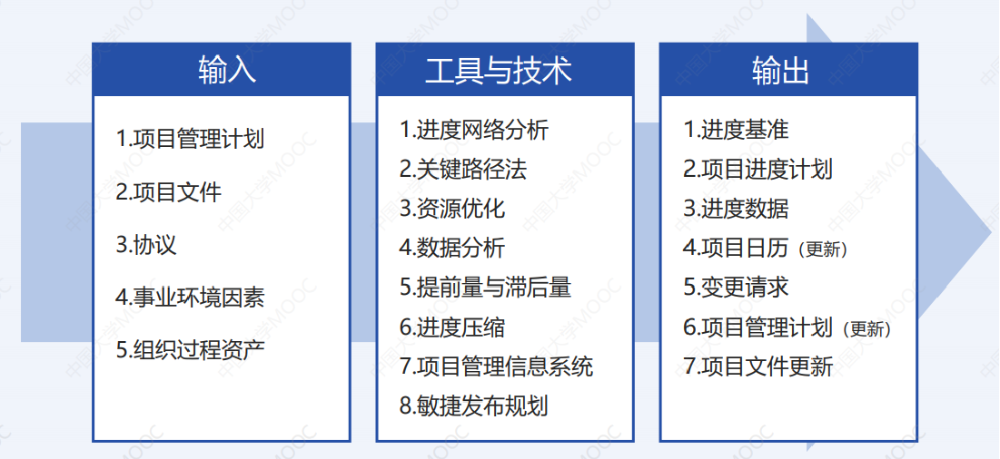​

1. **关键路径法（CPM）**

    *可参考数据结构的关键路径求解过程。*

    指决定项目**最早完成时间**的一系列活动，是**通过网络图的最长路径**，其**浮动时间最少**。

    1. 正推法

        计算最早开始ES和最早结束EF日期。

        *下图是单代号网络图*

        ​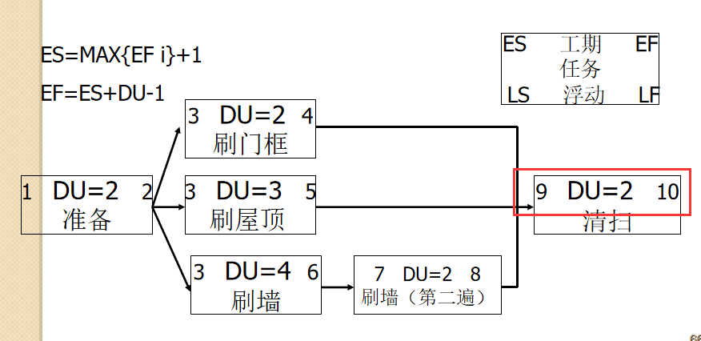​
    2. 逆推法

        计算最迟开始LS和最迟结束LF日期。

        ​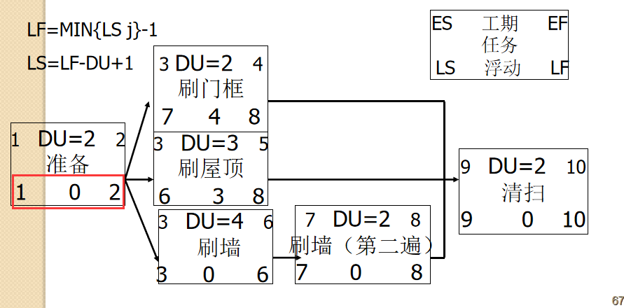​
    3. 使用关键路径缩短项目进度

        方法：赶工（Crashing，通过**增加资源**）或快速跟进（Fast tracking，通过**并行施工**）。

        1. 赶工

            以最少的成本代价获得最大限度的进度压缩 *。*

            **原则：对关键路径上的活动增加资源；选择那些赶工费用最少的关键活动来优先进行。**
        2. 快速跟进

            将顺序进行的任务改为并行实施。

            并行施工经常导致返工，增加了风险。
2. 进度计划的表示方法

    1. 甘特图

        跟踪甘特图：**将计划（基准）进度和实际进度进行对比。**

        *计划甘特图：不能跟踪，只是计划。*
    2. 里程碑（在甘特图中，或者里程碑图）

        计划的：实心菱形，表明重要事件。

        实际的：空心菱形，表示偏移。
3. 关键链进度计划

    当一个资源在同一时间用于多个任务时，多任务就会发生。

    关键链进度假定资源不能执行多任务，或者至少最小化多任务。

    思路：建议优先级。

    缓冲：完成任务的附加时间。

    关键链进度计划涉及关键路径分析、资源约束以及任务估算如何以缓冲的方式进行变更。
4. 计划评审技术（PERT）

# 6.7 **进度控制6（监控过程）**

定义：监督项目状态，以更新项目进度和管理进度基准变更的过程。

主要作用：在整个项目期间保持对进度基准的维护，且需要在整个项目期间开展。

## 输入、工具与技术和输出

​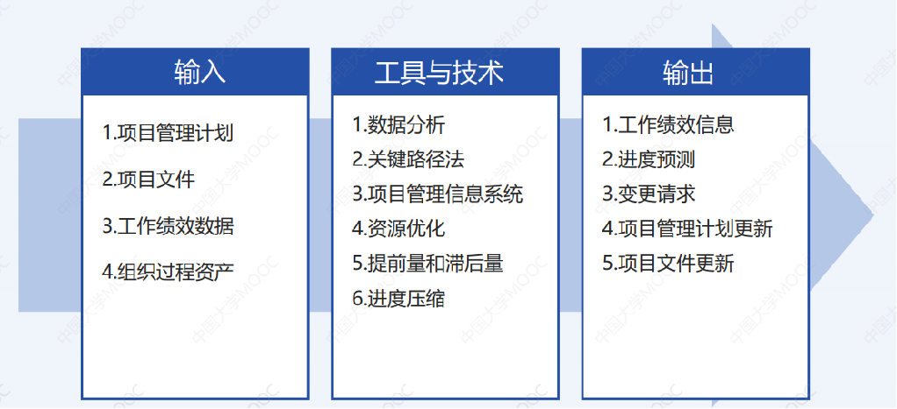​

# 6.8 使用软件辅助项目进度管理

# 快速测试

> 1.紧前活动、紧后活动、逻辑关系、提前和滞后、资源需求、约束条件、强制日期和活动相关的假设都是（）中的内容。
>
> 2.在其他人拟定完草稿之前，你不能开始编辑一项技术报告，这个关系类型是（）。
>
> 3.（）现实里计划和实际的项目进度信息。
>
> 4.（）是一种网络图技术，能够决定项目（）时间的一系列活动，用于预测整个项目的工期。是项目通过网络图（）的路径，具有（）浮动时间。
>
> 5.（）过程将用于计划、执行和控制项目进度的政策、流程和文档。

答案：

> 1.活动属性
>
> 2.完成-开始
>
> 3.跟踪甘特图
>
> 4.关键路径法 最早完成时间 最长路径 最短浮动时间
>
> 5.规划进度管理

# 课堂作业

> ​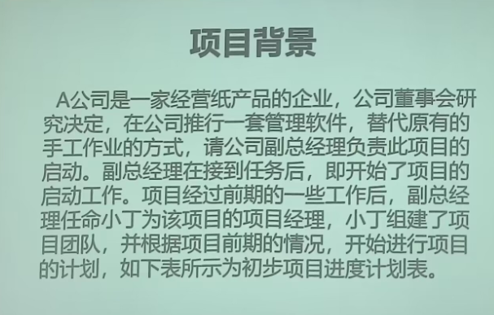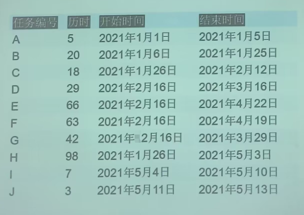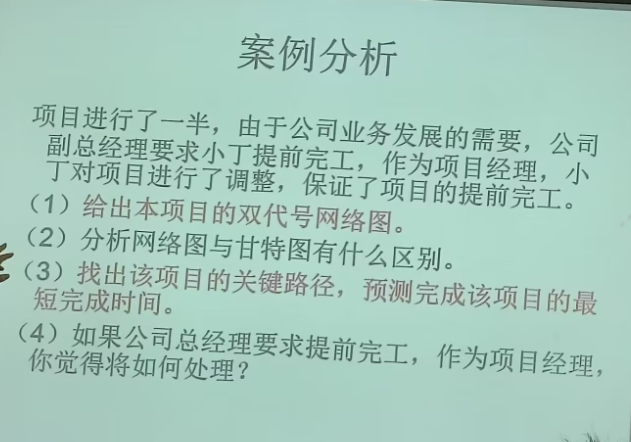​​​

答案：（第1问和第3问）

> ​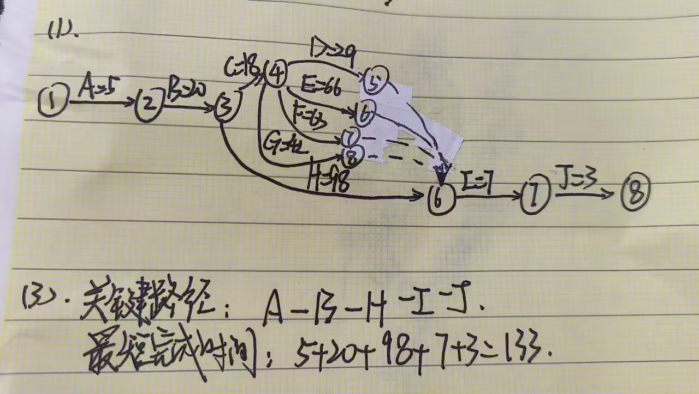​

​​

‍
