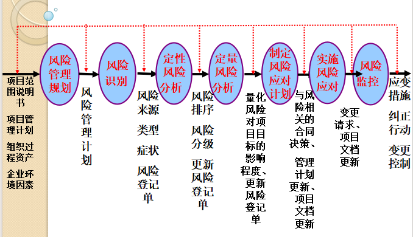
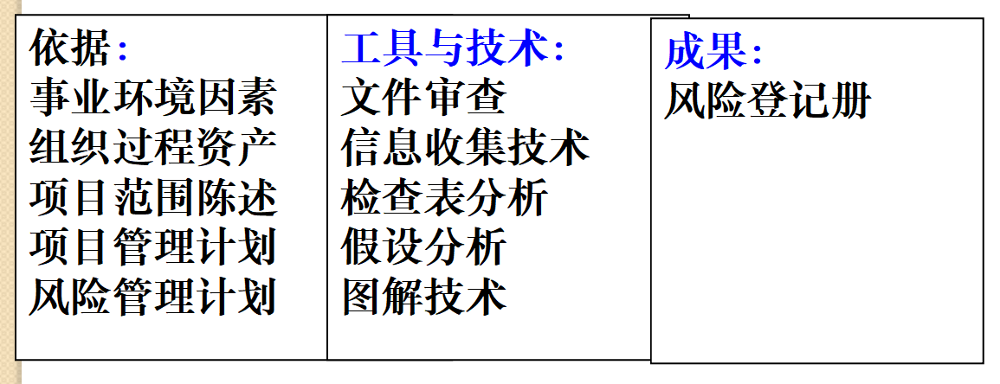
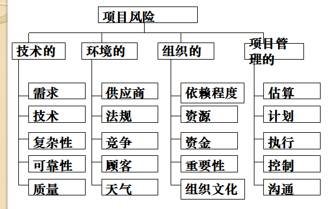
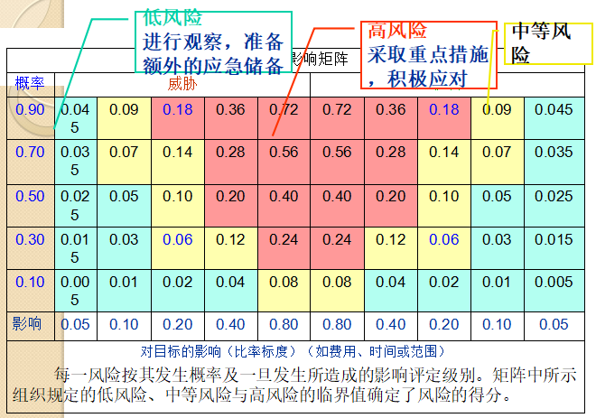
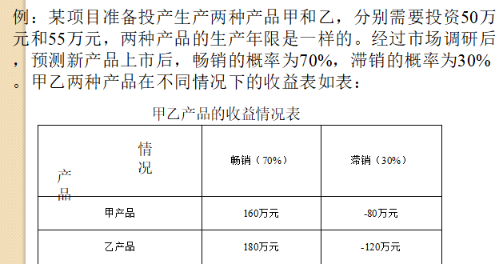
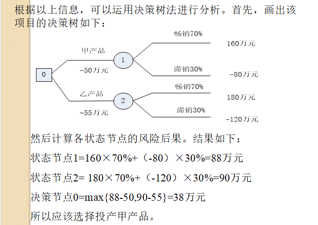
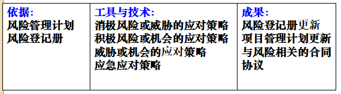

# 第十一章：项目风险管理

7个过程：风险管理规划（计划），风险识别（计划），**定性风险分析（计划），定量风险分析（计划）** ，制定风险应对计划（计划），实施风险应对（实施），风险监控（监控）。

# 11.1  项目风险管理概述

项目风险管理定义：通过风险识别、风险分析和风险评估去认识项目的风险，并以此为基础合理的使用各种风险应对措施、管理方法、技术和手段，对项目风险实行有效的应对和监控，妥善处理风险事件所造成的不利后果，以最低的成本实现项目总体目标的实践活动的总称。

风险效用或者风险容忍度：指在潜在的权衡中得到满足或者愉悦的程度。有3种程度：风险规避，风险中立，风险偏好，

​​

# 11.2  项目风险管理主要过程

# 11.3  风险管理规划 1计划过程

# 11.4  风险识别 2计划过程

一项贯穿于项目实施全过程的项目风险管理工作。

**项目风险识别的主要内容包括：识别并确定项目有哪些潜在的风险，识别引起这些风险的主要因素，识别项目风险可能引起的后果。**

## 输入、工具与技术和成果

​​

### 工具与技术

1. 信息收集技术

    1. 头脑风暴法
    2. 德尔菲技术：类似于头脑风暴，但是是**匿名**。
    3. 访谈
    4. SWOT分析：项目立项也使用了*立项的三角形是什么……好像要考？？*
2. 风险检查表

    从以往类似项目和其他信息途径收集到的风险经验的列表，通过查找此表可以简便快捷地识别风险。

    缺点是永远不可能编制一个详尽的风险检查表，而且管理者可能被检查表所局限，不能识别出该表未列出的风险，因此其应用范围有一定的局限性。

    这种方法一般在项目初期使用，以便提早减少风险因素。

### 输出

风险登记册。

风险分解图（RBS）

​​

# 11.5  定性风险分析 3计划过程

定义：在风险识别的基础上，运用概率和数理统计的方法对项目风险发生的概率、项目风险的影响范围、项目风险后果的严重程度和项目风险的发生时间以及对已经识别的风险的优先级进行估计和评价的分析活动。

## 输入、工具与技术和输出

### 工具与技术

1. 风险概率和影响评价

    风险概率是指风险发生的可能性大小，风险影响是指风险一旦发生对项目目标（包括时间、成本、范围和质量）产生的影响程度。

    **风险概率和影响**矩阵是将综合风险概率和风险影响这两个标度综合起来，以此为依据建立一个对风险或风险情况评定等级的矩阵，从而更有效的通过定性的方法对风险进行排序。

    ​​

### 输出

**项目风险的相对排序或优先级清单。**

# 11.6  定量风险分析 4计划过程

定义：在风险定性分析后，对排序在前面的、具有潜在重大影响的项目风险再进行量化分析，定量评价风险概率和影响程度，以便综合分析项目风险的整体水平。

*借助矩阵进一步进行评价。*

## 输入、工具与技术和输出

### 工具与技术

1. 敏感性分析
2. 期望值法
3. **决策树法**

    根据项目风险的基本特点，在反映风险背景环境的同时，描述项目风险发生的概率、后果以及项目风险的发展动态。

    决策树法先找出风险的状态、风险发生的概率、风险的后果等因素，然后根据这些因素绘制出一个**从左到右**展开的树状图，主要有**方块节点、圆形节点以及状态节点后的损益值**。

    ​​

    1. 方块节点：决策节点。由此引出与方案数量相同的方案分支，在分支上要标注方案的名称。
    2. 圆形节点：状态节点。从状态节点可以引出状态分支，在每一个分支上要标注自然状态的名称及其出现的主观概率。
    3. 状态节点后的损益值。​​
4. 模拟法

### 输出

进一步更新的风险登记册。

# 11.7  项目风险应对 5实施过程

**应对风险的计划包括：限定风险扩大机会的步骤，制定处理风险的计划。**

## 输入、工具与技术和输出

​​

### 工具与技术

1. 应对消极风险的策略

    1. 风险规避：消除特定的威胁或者风险。
    2. 风险接受：如果风险发生，接受其带来的后果。
    3. 风险转移：将风险结果用责任转移给第三方。
    4. 风险减轻：通过减少风险事件发生的概率来减轻风险事件的影响。
    5. 风险上报：将风险事件报告到更高级别的权力部门。
2. 应对积极风险的策略

    风险开拓，风险接受，风险分享，风险提高，风险上报。

# 11.8  风险监控

# 本章小结

> 风险是指损失或损害的可能性。项目具有风险。
>
> 风险管理是一项投资。组织或个人承担风险，以从潜在机会中获利。
>
> 风险效用或风险承受度是指从潜在回报中得到满足或快乐的程度。
>
> 风险管理的主要过程是：风险规划管理、风险识别定性风险分析、定量风险分析、风险应对计划和风险监控。
>
> 5个应对消极风险的基本措施是：规避、接受、减轻、转移、上报。

# 快速小测

题目

//TODO

答案

> 1.风险
>
> 2.风险定性分析
>
> 3.风险偏好型
>
> 4.风险定量分析
>
> 5.风险承受度
>
> 6.德尔菲技术
