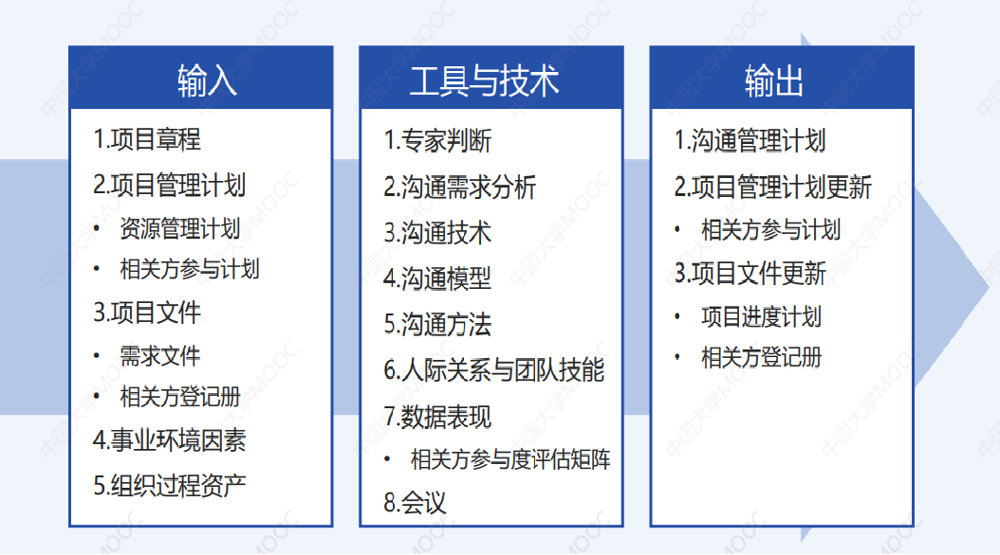
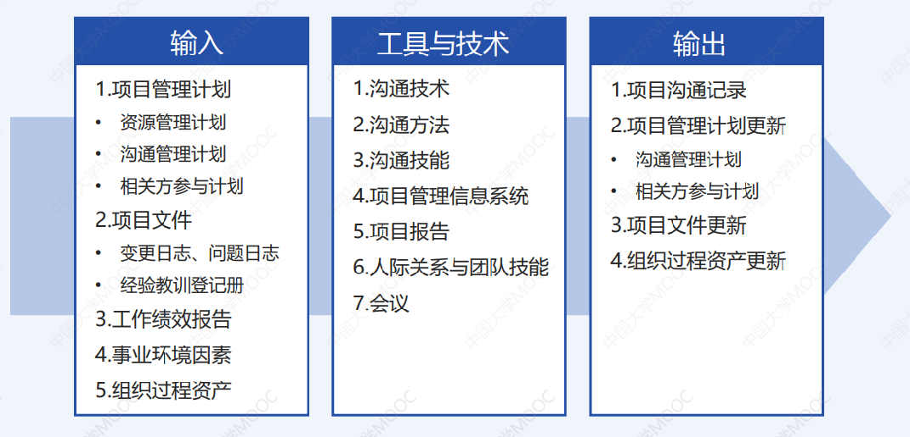
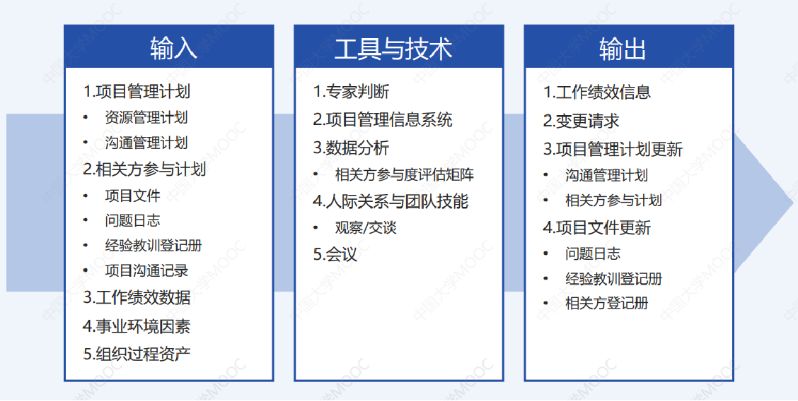

# 第十章 ：项目沟通管理

3个过程：规划沟通管理（计划过程）、管理沟通（实施过程）、沟通控制（监控过程）

# 10.1  项目沟通管理的重要性

目标：及时而适当地创建、收集、发送、储存和处理项目的信息。

# 10.2  沟通管理的过程

# 10.3  规划沟通管理 1计划过程

## 输入、工具与技术和输出

​​

### 工具与技术

1. 沟通模型

    沟通渠道与人数有关。

    **沟通渠道数目计算公式：S= n*(n–1)／2。S：沟通渠道数目，n:  参加沟通的人员个数。**

    3种模型：基本的线性模型，互动沟通模型，跨文化沟通的模型。
2. 沟通方法

    1. **互动沟通：有来有往，促进实时协作与交流。**
    2. **推式沟通：使信息广泛传播，不强调反馈。**
    3. **拉式沟通：接收方主动地找到发送方，需要获取精准的信息。**

    *邮件可以是互动沟通，也可能是推式沟通。企业提供联系网站、电话或邮箱等让别人主动联系的，是拉式沟通。*

    1. 也可以采用人际沟通、小组沟通、公众沟通、大众传播等方法

### 输出

1. 沟通管理计划
2. 项目管理计划的更新

# 10.4  管理沟通 2实施过程

定义：确保项目信息及时且恰当地收集、生成、发布、存储、检索、 管理、监督和最终处置的过程。  
主要作用：促成项目团队与相关方之间的**有效信息流动**。本过程需要在整个项目期间开展。

## 输入、工具与技术和输出

​​

### 输入

1. 工作绩效报告

    绩效报告输入的重要内容：项目计划和工作成果。

    绩效报告的主要输出：**状态报告（时间点）和进展报告（时间段）** 、项目预测和变更请求。

### 输出

1. 项目沟通记录

    主要包括：绩效报告、可交付成果的状态、进度进展、产生的成本、演示，以及相关方需要的其他信息。

# 10.5  监督沟通（控制沟通） 3监控过程

定义：确保满足项目及其相关方的信息需求的过程。

主要作用：按沟通管理计划和相关方参与计划的要求优化信息传递流程。

主要目标：在整个项目生命周期中确保信息的**最佳流动**​ *（沟通管理是有效沟通）* 。

### 输入、工具与技术和输出

​​

# 10.6  改善沟通的建议

# 小结

> 沟通失败常常是IT项目成功的最大的威胁。
>
> 沟通是项目管理成功的重要因素。
>
> 项目沟通管理的目标是及时而适当地创建、收集、发送、储存和处理项目的信息。
>
> 项目沟通管理过程包括：规划沟通管理、管理沟通和监督沟通。
>
> 为了改善项目的沟通，项目经理及其团队应当发展良好的冲突管理技能和其他沟通技能。

# 快速测试

题目

//TODO

答案

> 1.沟通失败
>
> 2.18
>
> 3.状态
>
> 4.经验教训
>
> 5.拉沟通？

‍
