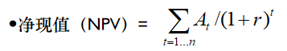
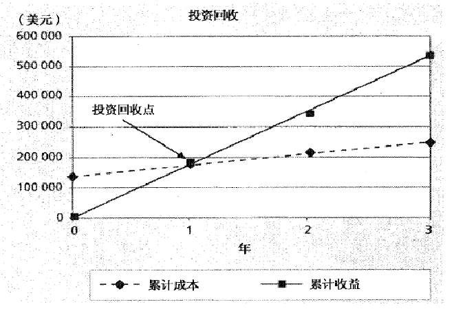
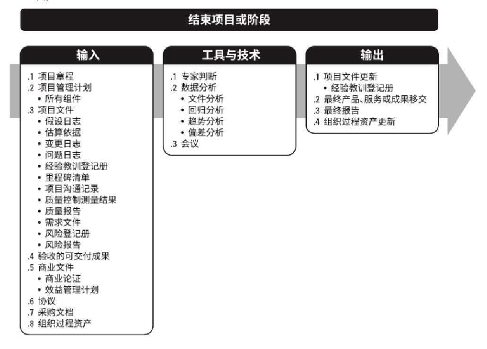

# 第四章：项目集成（整体）管理

> 前置知识
>
> **项目的10大知识领域**：范围、时间、成本、质量、人力资源、沟通、风险、 采购、集成（整体）管理、干系人管理。
>
> **项目的4个阶段**：概念、开发、实施、收尾。
>
> **项目的5个过程组**：启动、计划、执行、控制、收尾。

# 4.1 什么是项目集成管理

## 定义

在项目生命周期中协调所有其他项目管理知识领域所涉及的过程。

## 具体内容

项目集成管理围绕项目计划进行。

**主要过程：计划制定、计划执行和计划变更控制。**

项目集成管理在项目**整个生命周期内**。

## 成功的关键与项目经理

集成管理是实现整体项目成功的关键。

项目经理的主要任务是作好项目的集成管理。换而言之，**项目集成管理由项目经理负责**。

## 主要过程（7个过程组）

制定项目章程（第3章已经介绍），制定项目管理计划，指导和管理项目实施，管理项目知识，监控项目工作，整体变更控制，项目收尾。

# 4.2 战略计划和项目选择

项目管理的第一步决定做什么项目：**潜在项目-选择-启动**。

## 战略计划与SWOT（潜在项目）

用于战略计划的SWOT：内部优势、劣势和外部的机会、威胁。

*给一个案例，要会进行SWOT分析（指出内部优劣、外部机会与威胁），找出有潜力的项目。*

## 项目选择

**筛选IT项目计划的过程：筛选IT战略计划（识别关键业务领域），业务分析（记录主要业务过程），项目计划，资源分配。**

项目选择的方法分为5类：注重整个组织的需求，将IT项目进行分类，进行净现值等财务分析，运用加权评分模型，实施平衡记分卡。

1. 关注整个组织的需求

    **3个重要标准：需求、资金和意愿。**

2. 对IT项目进行分类

    以各种分类方法为基础进行项目选择  
    **3种分类方法：项目动机，基于时间的考虑筛选项目，优先权（高中低）。**

3. 进行财务分析

    **3种方法：净现值（NPV），投资收益率（ROI），投资回收期。**

    1. 净现值分析（NPV）  
        折现率r：用于折现现金流的比率。考虑了**金钱的时间价值、未来现金流的风险和不确定性**，也称为资本化率或者资本机会成本。

        At：成本或收益

        ​​
    2. 投资回报率/投资回报

        ​​

        |折现率|10%||||||
        | -------------------------------| -------------------------------------------| ----------------------------------| -------------------------------------------| ------------------------------------------| ------------------------------------------| ------------------------------------------|
        |项目1|Y1|Y2|Y3|Y4|Y5|TOTAL|
        |收益|￥ -|￥ 2,000.00|￥ 3,000.00|￥ 4,000.00|￥ 5,000.00|￥ 14,000.00|
        |成本|￥ 5,000.00|￥ 1,000.00|￥ 1,000.00|￥ 1,000.00|￥ 1,000.00|￥ 9,000.00|
        |现金流（现金流 = 收益 - 成本）|￥ -5,000.00|￥ 1,000.00|￥ 2,000.00|￥ 3,000.00|￥ 4,000.00|￥ 5,000.00|
        |折现成本（折现成本 = 成本 / (1+r)^t）|￥ -(5000 / 1.1 = 4545 因为是成本，所以4545取负数)​4,545.00(5000 / 1.1 = 4545 因为是成本，所以4545取负数)|￥ -826.00(1000 / 1.21 = 826)|￥ (1000 / 1.331 = 751)​-751.00(1000 / 1.331 = 751 用成本计算折现成本)|￥ -683.00(1000 / 1.4641 = 683)|￥ -621.00|￥ -7,427.00(求和即可（应该是7426）)|
        |折现收益（折现收益 = 收益 / (1+r)^t）|￥ -|￥ 1,653.00(2000 / 1.21 = 1653)|￥ 2,254.00|￥ 2,732.00|￥ 3,105.00|￥ 9,743.00|
        |折现（即：折现收益+折现成本（但因为后者是负数，看上去像相减））​收益（即：折现收益+折现成本（+是因为后者是负数）） +成本（即：折现收益+折现成本（但因为后者是负数，看上去像相减））|￥ -4,545.00 |￥ 826.00(1653 - 826 = 827（这里应该是827）) |￥ 1,503.00 |￥ 2,049.00 |￥ 2,484.00 |￥ 2,316.00 |
        ||||||||
        ||||||||
        |总收益（[这一阶段的总收益+成本] = 上一阶段的 + [折现收益+成本]） +成本（[这一阶段的总收益+成本] = 上一阶段的 + [折现收益+成本]）|￥ -4,545.00 |￥ -3,719.00(-4545 + 826 = -3719) |￥ -2,216.00 |￥ -167.00 |￥ 2,316.00 ||
        ||||||||
        ||||||||
        |NPV|￥ 2,316.00||||||
        |ROI|31%(2316 / 7427 = 31%)||||||
    3. 回收期分析

        以现金流的方式，将在项目中的**总投资全部收回**的时间。

        ​​
4. 加权评分模型
5. 平衡计分卡方法

    是一种方法论。

# 4.3 制定项目管理计划

定义：定义、准备和协调项目计划的所有组成部分，并把它们整合为一份综合项目管理计划的过程。

主要作用：**生成一份用于确定所有项目工作的基础及其执行方式的综合文件**。

为识别和控制项目变更提供了**基准**。基准是被记录下来的一个起点、一组度量和一组观察值，能否用于将来的比较。

仅开展一次或仅在项目的预定义点开展。

## 输入、工具与技术和输出

### 输入

项目章程，其他过程的输出，事业环境因素，组织过程资产。

### 工具与技术

1. 专家判断
2. 数据收集

    头脑风暴，核对单，焦点小组，访谈。
3. 人际关系与团队技能

    冲突管理，引导，会议管理。
4. 会议

### 输出

项目管理计划。

## 项目计划

定义：一个用来协调所有其他计划，以指导项目执行和控制的可操作的文件。

与项目执行的关系：相互渗透，谁负责做这件事，就该由谁来做这个计划。

内容：主要包括整体介绍、组织描述、管理程序、技术程序、任务范围、时间进度、经费预算等。

项目的管理和方法：管理目标，项目控制，风险管理，项目人员，技术过程。

项目任务：主要工作内容，主要可交付成果，工作有关的其他信息。

项目进度：进度概要，进度细要，与进度有关的其他信息。

项目预算：预算概要，预算细要，其他信息。

利益相关者分析：项目管理的最终目的就是要使项目满足或超过项目干系人的需求和期望。

# 4.4 指导与管理项目工作

定义：为实现项目目标而领导和执行项目管理计划中所确定的工作，并实施已批准变更的过程。

主要作用：对项目工作和可交付成果开展综合管理，以提高项目成功的可能性。需要在整个项目期间开展。

管理理解：将项目计划和项目执行视为互相渗透、不可分割的活动。

## 输入、工具与技术和输出

### 输入

1. 项目管理计划

    任何组件。
2. 项目文件

    变更日志，经验教训登记册，里程碑清单，项目沟通记录，项目进度计划，需求跟踪矩阵，风险登记册，风险报告
3. 批准的变更请求
4. 事业环境因素
5. 组织过程资产

### 工具与技术

专家判断，**项目管理信息系统（PMIS）** ，会议。

### 输出

1. 可交付成果
2. 工作绩效**数据（信息）**
3. 问题日志
4. 变更请求
5. 项目管理计划更新

    任何组件。
6. 项目文件更新

    活动清单，假设日志，经验教训登记册，需求文件，风险登记册，相关方登记册。
7. 组织过程资产更新

‍

‍

# 4.* 管理项目知识

定义：使用现有知识并**生成新知识**，以实现项目目标，并且帮助组织学习的过程。

主要作用：利用已有的组织知识来创造或改进项目成果，并且使当前项目创造的知识可用于支持组织运营和未来的项目或阶段。

需要在整个项目期间开展。

## 输入、工具与技术和输出

### 输入

1. 项目管理计划

    所有组件。
2. 项目文件

    经验教训登记册，项目团队派工单，资源分解结构，供方选择标准，相关方登记册。
3. 可交付成果
4. 事业环境因素
5. 组织过程资产

### 工具与技术

1. 专家判断
2. 知识管理
3. 信息管理
4. 人际关系与团队技能

    积极倾听，引导，领导力，人际交往，政治意识。

### 输出

1. 经验教训登记册
2. 项目管理计划更新

    任何组件。
3. 组织过程资产更新

‍

# 4.5 监控项目工作

定义：跟踪、审查和报告整体项目进展，以实现项目管理计划中确定的绩效目标的过程。

内容：包括采集、衡量、发布绩效信息，还包括评估度量数据和分析趋势，以确定可以做哪些过程改进。

主要作用：让相关方了解项目的当前状态并认可为处理绩效问题而采取的行动，以及通过成本和进度预测，让相关方了解未来项目状态。

## 输入、工具与技术和输出

### 输入

1. 项目管理计划

    任何组件。
2. 项目文件

    假设日志，估算依据，成本预测，问题日志，经验教训登记册，里程碑清单，质量报告，风险登记册，风险报告，进度预测。
3. 工作绩效信息
4. 协议
5. 事业环境因素
6. 组织过程管理

### 工具与技术

1. 专家判断
2. 数据分析

    备选方案分析，成本效益分析，挣值分析，根本原因分析，趋势分析，偏差分析。
3. 决策
4. 会议

### 输出

1. **工作绩效报告**

    包括状态报告、进度报告、备忘录、其他用来沟通绩效的文件。
2. **变更请求**

    **包括纠正、预防和缺陷补救。**
3. 项目管理计划更新  
    任何组件。
4. 项目文件更新  
    成本预测，问题日志，经验教训登记册，风险登记册，进度预测。

# 4.6 实施集成变更控制

定义：审查所有变更请求、批准变更，管理对可交付成果、项目文件和项目管理计划的变更，并对变更处理结果进行沟通的过程。

主要作用：确保对项目中已记录在案的变更做综合评审。

涉及在整个项目的生命周期中识别、估计和管理变更。

## 输入、工具与技术和输出

### 输入

1. 项目管理计划  
    变更管理计划，配置管理计划，范围基准，进度基准，成本基准。
2. 项目文件  
    估算依据，需求跟踪矩阵，风险报告。
3. 工作绩效报告
4. 变更请求
5. 事业环境因素
6. 组织过程资产

### 工具与技术

1. 专家判断
2. 变更控制工具
3. 数据分析  
    备选方案分析，成本效益分析。
4. 决策  
    投票，独裁型决策制定，多标准决策分析。
5. 会议

### 输出

1. 批准的变更请求
2. 项目管理计划更新  
    任何组件。
3. 项目文件更新  
    变更日志。

## 变更控制系统

包括建立变更控制委员会，配置管理（正确、完整），及时进行沟通。

# 4.7 项目或阶段收尾

定义：是终结项目、阶段或合同的所有活动的过程。

主要作用：存档项目或阶段信息，完成计划的工作，释放组织团队资源以展开新的工作。

仅开展一次或仅在项目的预定义点开展。

## 输入、工具与技术和输出

​​

主要成果：行政收尾程序，合同收尾程序，最终产品、服务或者成果，组织过程资产更新。

过程资产：项目团队以实用方式提供的一份包括项目文档、项目终止文件和历史信息的清单。

# 本章小结

项目整体管理/综合管理是最重要的项目管理知识。

项目集成管理的7个过程、主要输出。

整体管理的3个主要过程是计划制定、计划执行、计划变更控制。

项目计划包括项目整体概述，项目的组织，管理与技术过程，项目任务、进度安排与预算等。

项目经理应该与项目干系人建立良好的关系，满足他们的需要。

项目计划与项目执行应该是相互渗透的。谁负责做这件事，就该由谁来做这个计划。

通过进行整体变更控制，使项目朝着提高效率、效益。

高层的支持是项目成功的关键要素。

‍

# 快速测试

> 1.在选择信息技术项目时，4个阶段规划过程的最后一步是（    ）。  
> 2.（    ）是一份正式认可项目的文件，并为项目目标和管理提供方向。  
> 3.项目产生的文档清单、终止项目文件以及历史资料都是（    ）的例子。  
> 4.如果一个项目总的折现后的收益是120000美元，总的折现后的费用是100000美元，则回报率（ROI）是（   ）。  
> 5.项目经理通过（    ）来在整个项目生命周期内识别、估计和管理变更。

答案

> 1.收尾
>
> 2.项目章程
>
> 3.
>
> 4.20%
>
> 5.整体变更控制

# 课堂讨论

> 基于开篇案例，讨论如下问题：  
> 案例中真正的问题是什么？  
> 案例中的情况是否在现实中存在？为什么？  
> Nick Carson是一个好的项目经理吗？为什么？  
> Nick Carson应该怎样做一个更好的项目经理？  
> 高层管理人员应该做些什么来帮助Nick?  
> 如果你作为本项目的项目经理，应该如何来管理好这个项目。（用所学知识写一份课后作业 1000字以上 ）

答案见作业。

‍
